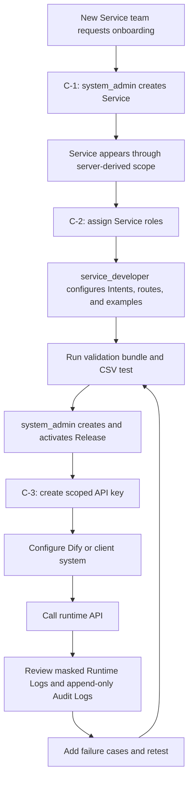

# Admin UI Authorization-First Onboarding Flow

This document records the target Admin UI flow for financial closed-network
Service onboarding. It complements:

- `docs/adr/2026-07-06-account-auth-service-rbac-to-fine-grained-authorization.md`
- `docs/adr/2026-07-08-authorization-first-admin-ui-onboarding.md`
- `docs/AdminUI_Handbook/v04/PATTERN_KIT.md`

## Why This Exists

The product will be used by multiple Services. In a financial closed-network
environment, Service creation, Service membership, role assignment, API-key
scope, runtime access, and audit evidence are not secondary administration
tasks. They are part of the onboarding workflow.

The Admin UI should therefore be tested and built around the full C flow, even
when implementation is split into smaller C-1, C-2, and C-3 slices.

## C Flow Overview

## C-1: Service Onboarding

Goal: remove the current true-E2E blocker by allowing a `system_admin` to
register a Service from the Admin UI.

Expected UX:

- Create Service with `service_id`, display name, environment, default threshold
  preset, and input limit.
- Refresh `/me/services` or otherwise make the newly created Service available
  in the Service picker.
- Show Service status and environment in the scope bar.
- Record an audit event for Service creation.

Current implementation note:

- Backend `POST /admin/v1/services` exists.
- Admin UI `/services` lets `system_admin` create a Service, refresh
  server-derived Service scope, select the new Service, and continue to Intent
  Catalog.
- Service membership and role assignment remain C-2 work and must not be faked
  in C-1.

## C-2: Service Membership, Roles, And Developer Validation

Goal: make authorization part of the product flow, not a setup shortcut.

Expected UX:

- `system_admin` or an authorized future owner assigns scoped Service roles.
- Users see only Services returned by `/me/services`.
- `service_developer` can manage Intents, examples, policy/catalog versions,
  and test runs only for assigned Services.
- `service_operator` and `auditor` receive read paths appropriate to their
  Service role.
- Unauthorized users cannot inspect or mutate another Service.
- Test-run failure results guide the developer back to examples or keyword
  improvements.

Backend contract note:

- Account login and Service-scoped RBAC exist as the first authorization
  milestone.
- Any new role-assignment UI must use server-derived identity and roles. It must
  not reintroduce trusted browser headers.

## C-3: Runtime Integration And Operations

Goal: connect a validated Release to real client usage and operational evidence.

Expected UX:

- Create API keys from the selected Service and environment.
- Select allowed intents and route keys from known candidates.
- Show the API key secret once.
- Keep API key inventory free of raw secrets.
- Provide runtime setup guidance for Dify or another client system.
- Use checklist and docs guidance for runtime validation. Do not run a browser
  sample call with the one-time secret.
- Show masked Runtime Logs and append-only Audit Logs after runtime usage.

Backend contract note:

- Runtime API `/v1/intent-route` exists.
- Admin UI C-3 uses service-scoped API key lifecycle endpoints:
  `GET /admin/v1/services/{service_id}/api-keys`,
  `POST /admin/v1/services/{service_id}/api-keys`, and
  `POST /admin/v1/services/{service_id}/api-keys/{key_id}:revoke`.
- Runtime setup guidance comes from
  `GET /admin/v1/services/{service_id}/runtime-setup` and returns
  `selected_key` metadata only, never the raw secret.

## Non-Negotiables

- Normal Admin UI browser requests use account login and the
  `irt_admin_session` cookie.
- Do not send `X-Admin-Token`, `X-Actor-Id`, `X-Actor-Roles`, or
  `X-Service-Scope` from normal browser UI requests.
- Service picker options come from `/me/services`.
- Every write action is gated from server-derived global roles and selected
  Service roles.
- Dangerous or operationally meaningful writes use confirmation.
- Runtime logs show `query_masked` by default.
- Audit logs remain append-only.
- C-2 and C-3 capabilities must render as disabled or informational until the
  relevant backend contract exists.

## Manual QA Implications

Manual QA should record both product convenience and authorization boundaries:

- Can a new Service be onboarded without command-line setup?
- Can the intended developer see the Service after role assignment?
- Can an unrelated user fail safely with no data exposure?
- Can the developer complete Intents, examples, CSV validation, and improvement
  without ML or embedding knowledge?
- Can the admin create a Release and scoped API key without copying internal
  IDs?
- Can the client setup be completed from UI-provided guidance?
- Can runtime and audit evidence prove who changed what and which Service was
  affected?
