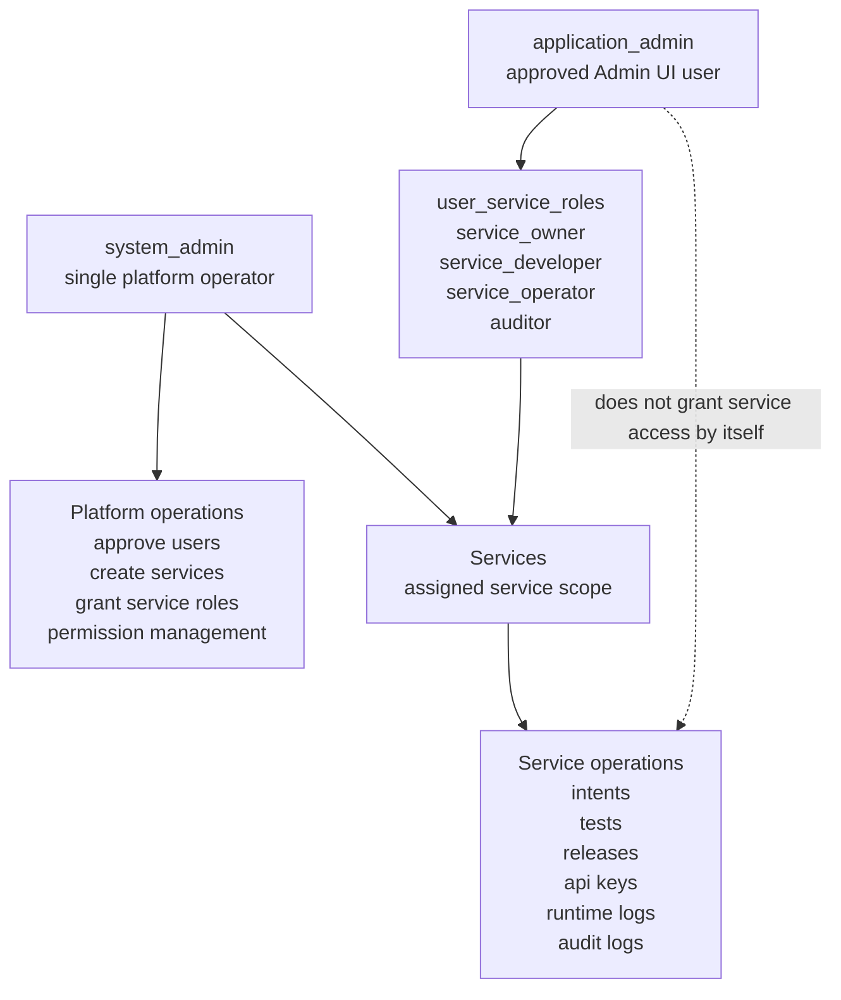
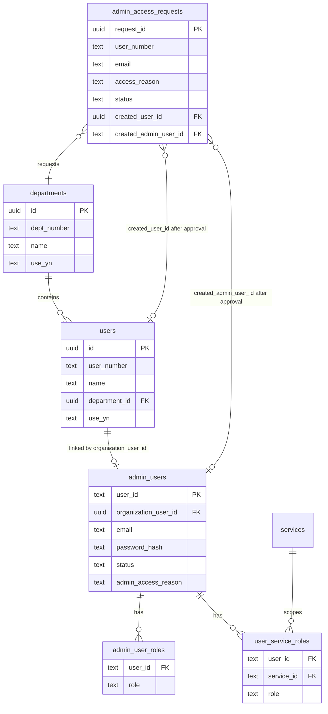
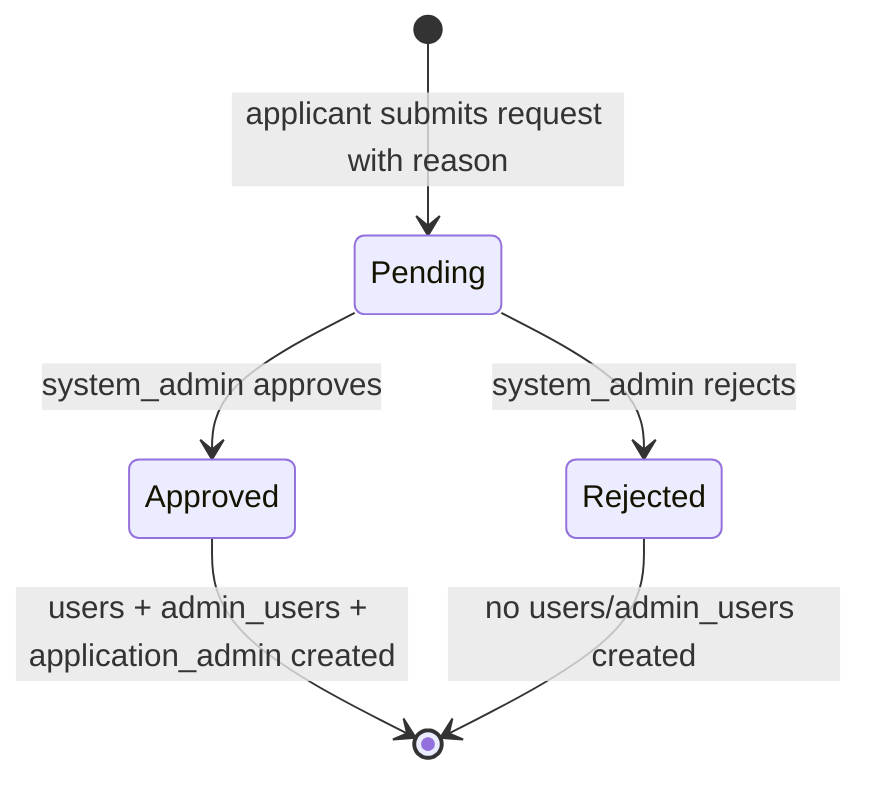
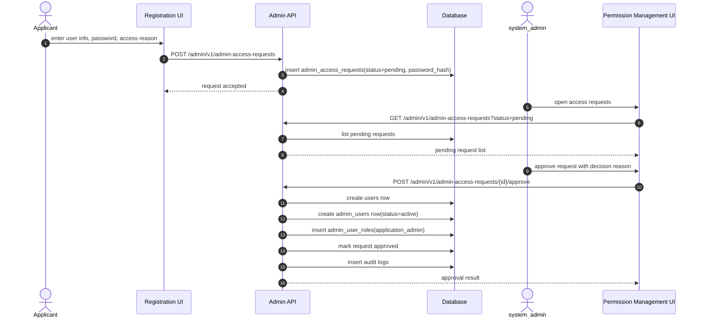
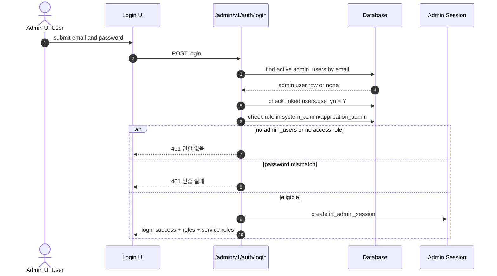
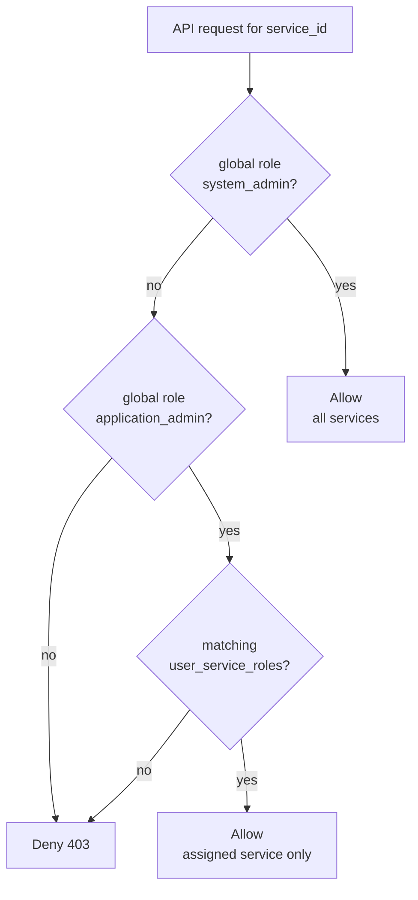
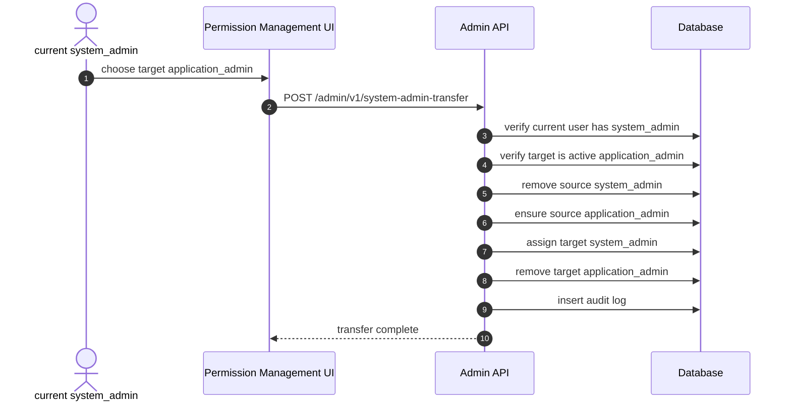
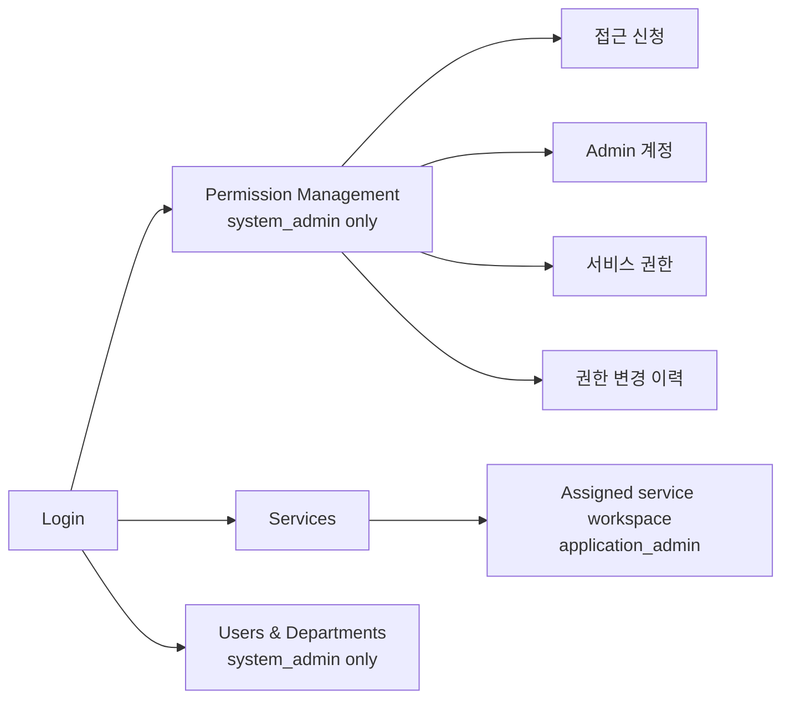

# Application Admin Approval RBAC Implementation Plan

> **For agentic workers:** REQUIRED SUB-SKILL: Use superpowers:subagent-driven-development (recommended) or superpowers:executing-plans to implement this plan task-by-task. Steps use checkbox (`- [ ]`) syntax for tracking.

**Goal:** Add an approval-based Admin Console registration flow where `system_admin` is the single platform operator role, approved application developers receive `application_admin`, and actual service operations remain scoped through `user_service_roles`.

**Architecture:** Keep `users` as the organization directory and keep Admin Console access derived from `admin_users`, `admin_user_roles`, and `user_service_roles`. Add `application_admin` as a global Admin Console access role, but do not let it grant service access by itself. Add an approval request table so self-service registration creates a pending request and `system_admin` approval creates the organization user, Admin account, and `application_admin` grant in one transaction. Pending requests must be unique by `email_normalized` and `user_number`, while approved/rejected rows remain as history with nullable `password_hash`.

**Tech Stack:** FastAPI, Pydantic v2, SQLAlchemy ORM, Alembic, PostgreSQL partial unique index, pytest, React 18, TypeScript, Umi Max 4, Ant Design 5, ProComponents, Vitest, Umi `request`.

## Global Constraints

- `users` remains an organization directory table and must not gain `admin_yn`, `is_admin`, or equivalent authorization flags.
- `admin_users` remains the Admin Console account table.
- `admin_user_roles.role = 'system_admin'` must be globally unique.
- `admin_user_roles.role = 'application_admin'` means Admin UI access approval only; it must not grant service operations by itself.
- `user_service_roles` remains the only source for application developer service-scoped permissions.
- Only `system_admin` can approve application admin registration, create Admin users, create Services, and grant/revoke Service roles.
- `application_admin` cannot access Permission Management, organization directory management, service creation, or service membership management.
- Normal Admin UI browser requests must use the `irt_admin_session` HttpOnly cookie; do not add `Authorization: Bearer`, React Query, axios, trusted actor headers, fake server pagination, or live polling.
- Dangerous role changes and rejections must use `ConfirmActionButton` or the existing confirm modal pattern.
- Existing `.env` must not be committed.

---

## Visual Architecture

### 1. Role Boundary Overview



핵심 해석:

- `system_admin`은 플랫폼 전체 운영자이며 단 1명입니다.
- `application_admin`은 Admin UI 접근 승인자입니다.
- `application_admin`만으로는 서비스 작업을 할 수 없습니다.
- 실제 서비스 작업은 반드시 `user_service_roles`가 있어야 합니다.

### 2. Data Ownership Map



핵심 해석:

- 배치 등록은 `users`까지만 만듭니다.
- 웹 신청은 먼저 `admin_access_requests`만 만듭니다.
- 승인 시 `users`, `admin_users`, `admin_user_roles(application_admin)`가 한 트랜잭션으로 생성됩니다.
- 서비스별 실제 권한은 `user_service_roles`에 남습니다.

### 3. Registration Request Lifecycle



핵심 해석:

- 신청 단계에서는 아직 로그인 가능한 Admin 계정이 생기지 않습니다.
- 반려되면 `users`와 `admin_users`를 만들지 않습니다.
- 승인된 요청만 Admin Console 접근 후보가 됩니다.

### 4. Web Registration Approval Sequence



핵심 해석:

- 신청자의 비밀번호는 API에서 즉시 hash 처리합니다.
- 승인 작업은 중간 상태가 남지 않도록 하나의 트랜잭션으로 처리합니다.
- `system_admin`이 승인하지 않으면 `application_admin` 권한은 절대 생기지 않습니다.

### 5. Login Eligibility Sequence



핵심 해석:

- `users`만 있는 사람은 로그인되지 않습니다.
- `admin_users`만 있어도 충분하지 않습니다.
- `system_admin` 또는 `application_admin` 중 하나가 있어야 Admin Console 세션을 받을 수 있습니다.

### 6. Service Access Decision



핵심 해석:

- `system_admin`은 모니터링 목적까지 포함해 모든 서비스에 접근할 수 있습니다.
- `application_admin`은 반드시 서비스별 권한이 있어야 합니다.
- 서비스별 권한이 없는 `application_admin`은 로그인은 가능해도 실제 서비스 작업은 거부됩니다.

### 7. Single `system_admin` Transfer



핵심 해석:

- `system_admin`은 일반 grant/revoke 버튼으로 변경하지 않습니다.
- 단일성 보장을 위해 이관 API가 원자적으로 처리합니다.
- 중간에 `system_admin`이 0명 또는 2명이 되는 상태를 만들지 않습니다.

### 8. Expected UI Navigation After This Work



핵심 해석:

- `application_admin`은 Permission Management에 들어갈 수 없습니다.
- `application_admin`은 Services에서 인가받은 서비스만 봅니다.
- `system_admin`은 Permission Management에서 신청, 계정, 서비스 권한, 이력을 모두 관리합니다.

## File Structure

- Create: `alembic/versions/0008_application_admin_approval_rbac.py`
  - Adds `application_admin` to the global role check constraint.
  - Adds a partial unique index enforcing a single `system_admin`.
  - Adds `admin_users.admin_access_reason`.
  - Adds `admin_access_requests`.
- Modify: `src/intent_routing/db/models.py`
  - Adds `AdminAccessRequest`.
  - Updates `AdminUser` with `admin_access_reason`.
  - Updates `AdminUserRole` check constraint to allow `application_admin`.
- Modify: `src/intent_routing/db/repositories.py`
  - Adds request create/list/approve/reject helpers.
  - Updates global role allow-list.
  - Adds single-`system_admin` enforcement helpers.
  - Updates login eligibility and risk summaries for `application_admin`.
- Modify: `src/intent_routing/api/admin_auth.py`
  - Requires at least one access role (`system_admin` or `application_admin`) for Admin Console login.
  - Keeps password hashes out of responses.
- Modify: `src/intent_routing/api/admin.py`
  - Adds schemas and endpoints for application admin registration requests.
  - Updates managed Admin user APIs for `application_admin`.
  - Adds a guarded `system_admin` transfer endpoint or explicit transfer helper.
- Modify: `src/intent_routing/api/admin_dependencies.py`
  - Keeps `system_admin` as all-service-scope.
  - Does not treat `application_admin` as all-service-scope.
- Modify: `src/intent_routing/security/admin_provisioning.py`
  - Keeps startup provisioning as the only automatic `system_admin` source.
  - Refuses to create a second `system_admin`.
- Modify: `frontend/intent-routing-console/src/types/api.d.ts`
  - Adds `application_admin` to global Admin role types.
  - Adds request/approval response types.
- Modify: `frontend/intent-routing-console/src/services/adminServices.ts`
  - Adds request/approval/rejection service functions using Umi `request`.
- Modify: `frontend/intent-routing-console/src/pages/PermissionManagement/permissionManagement.ts`
  - Adds helpers and labels for `application_admin`.
  - Keeps Permission Management access restricted to `system_admin`.
- Modify: `frontend/intent-routing-console/src/pages/PermissionManagement/index.tsx`
  - Adds an application admin requests tab or section visible only to `system_admin`.
  - Replaces generic `system_admin 부여` row action with single-owner transfer UX.
- Modify: `frontend/intent-routing-console/src/pages/OrganizationDirectory/index.tsx`
  - Stops encouraging direct `system_admin` grant from user edit modal.
  - Shows linked Admin account roles including `application_admin`.
- Test: `tests/unit/test_account_auth_schema_contract.py`
- Test: `tests/unit/test_permission_management_repository.py`
- Test: `tests/integration/test_admin_account_auth_api.py`
- Test: `tests/integration/test_admin_user_management_api.py`
- Test: `tests/integration/test_permission_management_api.py`
- Test: `tests/integration/test_admin_service_rbac_flow.py`
- Test: `frontend/intent-routing-console/src/services/adminServices.test.ts`
- Test: `frontend/intent-routing-console/src/pages/PermissionManagement/permissionManagement.test.ts`
- Test: `frontend/intent-routing-console/src/pages/OrganizationDirectory/directoryForms.test.ts`

## Task 1: ADR And Policy Contract

**Files:**
- Create: `docs/adr/2026-07-15-application-admin-approval-rbac.md`
- Modify: `docs/adr/2026-07-06-account-auth-service-rbac-to-fine-grained-authorization.md`
- Modify: `docs/adr/2026-07-14-central-iam-permission-management-console.md`

**Interfaces:**
- Consumes: existing accepted ADRs for organization directory separation, central IAM, and service RBAC.
- Produces: accepted architecture contract for `system_admin`, `application_admin`, approval requests, and single-system-admin enforcement.

- [x] **Step 1: Write the ADR**

Create `docs/adr/2026-07-15-application-admin-approval-rbac.md` with this decision:

```markdown
# ADR: Application Admin Approval RBAC

## Status

Accepted

## Context

The Admin Console needs two different operator groups:

- `system_admin`: the single platform operator who approves Admin Console access, creates Services, and grants Service roles.
- `application_admin`: an approved application developer who may use the Admin UI only inside Services assigned through `user_service_roles`.

The organization directory `users` table must remain separate from authorization. A `users` row alone must not grant Admin Console access.

## Decision

Add `application_admin` to `admin_user_roles.role`.

`system_admin` remains a global platform role and must exist at most once. `application_admin` is a global access role only. It allows Admin Console login for an approved account, but it does not grant Service access, Service creation, Permission Management access, or Service membership management.

Actual application work remains scoped through `user_service_roles`.

Introduce `admin_access_requests` for self-service registration. A pending request contains the requested organization user data, login email, hashed password, and required access reason. Approval by `system_admin` creates the `users` row, the linked `admin_users` row, and the `application_admin` global role in one transaction. Batch imports continue to create only `users`.

## Consequences

`system_admin` is the only role allowed to manage Admin users, Services, Service membership, and Permission Management. `application_admin` must receive one or more Service roles before it can operate on a Service.

Login eligibility requires an active `admin_users` row, an active linked organization user when linked, and either `system_admin` or `application_admin`.

## Verification

Tests must prove that only one `system_admin` can exist, `application_admin` can log in but cannot access Permission Management without Service roles, and Service operations remain limited by `user_service_roles`.
```

- [x] **Step 2: Update existing ADR cross-references**

In `docs/adr/2026-07-06-account-auth-service-rbac-to-fine-grained-authorization.md`, add `application_admin` as an Admin Console access role and state that it grants no Service scope.

In `docs/adr/2026-07-14-central-iam-permission-management-console.md`, update Permission Management to remain `system_admin` only and add application admin request review.

- [x] **Step 3: Verify ADR content**

Run:

```bash
rg -n "application_admin|single platform|admin_access_requests" docs/adr/2026-07-15-application-admin-approval-rbac.md docs/adr/2026-07-06-account-auth-service-rbac-to-fine-grained-authorization.md docs/adr/2026-07-14-central-iam-permission-management-console.md
```

Expected: all three documents mention the new role and the request/approval model where appropriate.

## Task 2: Schema Migration And Model Contract

**Files:**
- Create: `alembic/versions/0008_application_admin_approval_rbac.py`
- Modify: `src/intent_routing/db/models.py`
- Modify: `tests/unit/test_account_auth_schema_contract.py`

**Interfaces:**
- Consumes: current `admin_users`, `admin_user_roles`, `users`, and `departments`.
- Produces: `admin_access_requests` table, `admin_users.admin_access_reason`, `application_admin` check constraint, and unique single-`system_admin` index.

- [x] **Step 1: Write failing schema tests**

Add tests to `tests/unit/test_account_auth_schema_contract.py`:

```python
def test_admin_user_roles_allow_application_admin_and_single_system_admin_index(
    db_session: Session,
) -> None:
    inspector = inspect(db_session.bind)
    admin_user_roles = models.AdminUserRole.__table__

    assert _has_check_constraint(admin_user_roles, "ck_admin_user_roles_role")
    check_sql = " ".join(
        constraint.sqltext.text
        for constraint in admin_user_roles.constraints
        if getattr(constraint, "name", "") == "ck_admin_user_roles_role"
    )
    assert "system_admin" in check_sql
    assert "application_admin" in check_sql

    index_names = {
        index["name"] for index in inspector.get_indexes("admin_user_roles")
    }
    assert "uq_admin_user_roles_single_system_admin" in index_names


def test_admin_access_requests_schema_exists(db_session: Session) -> None:
    inspector = inspect(db_session.bind)
    assert "admin_access_requests" in inspector.get_table_names()

    columns = {column["name"] for column in inspector.get_columns("admin_access_requests")}
    assert {
        "request_id",
        "user_number",
        "name",
        "department_id",
        "email",
        "email_normalized",
        "password_hash",
        "access_reason",
        "status",
        "requested_at",
        "decided_at",
        "decided_by",
        "decision_reason",
        "created_user_id",
        "created_admin_user_id",
    } <= columns

    admin_columns = {column["name"] for column in inspector.get_columns("admin_users")}
    assert "admin_access_reason" in admin_columns
```

- [x] **Step 2: Run tests to confirm failure**

Run:

```bash
uv run pytest tests/unit/test_account_auth_schema_contract.py::test_admin_user_roles_allow_application_admin_and_single_system_admin_index tests/unit/test_account_auth_schema_contract.py::test_admin_access_requests_schema_exists -q
```

Expected: FAIL because migration/model changes do not exist yet.

- [x] **Step 3: Add Alembic migration**

Create `alembic/versions/0008_application_admin_approval_rbac.py`:

```python
"""Add application admin approval RBAC.

Revision ID: 0008_application_admin_approval_rbac
Revises: 0007_organization_directory
Create Date: 2026-07-15
"""

from collections.abc import Sequence

import sqlalchemy as sa
from sqlalchemy.dialects import postgresql

from alembic import op

revision: str = "0008_application_admin_approval_rbac"
down_revision: str | None = "0007_organization_directory"
branch_labels: str | Sequence[str] | None = None
depends_on: str | Sequence[str] | None = None

TIMESTAMPTZ = sa.DateTime(timezone=True)


def upgrade() -> None:
    bind = op.get_bind()
    system_admin_count = bind.execute(
        sa.text("select count(*) from admin_user_roles where role = 'system_admin'")
    ).scalar_one()
    if system_admin_count > 1:
        raise RuntimeError(
            "Cannot add single-system-admin constraint while multiple system_admin "
            "rows exist. Resolve duplicates before migration."
        )

    op.drop_constraint(
        "ck_admin_user_roles_role",
        "admin_user_roles",
        type_="check",
    )
    op.create_check_constraint(
        "ck_admin_user_roles_role",
        "admin_user_roles",
        "role in ('system_admin', 'application_admin')",
    )
    op.create_index(
        "uq_admin_user_roles_single_system_admin",
        "admin_user_roles",
        ["role"],
        unique=True,
        postgresql_where=sa.text("role = 'system_admin'"),
    )
    op.add_column(
        "admin_users",
        sa.Column(
            "admin_access_reason",
            sa.Text(),
            nullable=False,
            server_default=sa.text("'legacy account'"),
        ),
    )
    op.create_table(
        "admin_access_requests",
        sa.Column("request_id", postgresql.UUID(as_uuid=True), primary_key=True),
        sa.Column("user_number", sa.Text(), nullable=False),
        sa.Column("name", sa.Text(), nullable=False),
        sa.Column("department_id", postgresql.UUID(as_uuid=True), nullable=False),
        sa.Column("email", sa.Text(), nullable=False),
        sa.Column("email_normalized", sa.Text(), nullable=False),
        sa.Column("password_hash", sa.Text(), nullable=False),
        sa.Column("access_reason", sa.Text(), nullable=False),
        sa.Column("status", sa.Text(), nullable=False, server_default=sa.text("'pending'")),
        sa.Column("requested_at", TIMESTAMPTZ, nullable=False),
        sa.Column("decided_at", TIMESTAMPTZ, nullable=True),
        sa.Column("decided_by", sa.Text(), nullable=True),
        sa.Column("decision_reason", sa.Text(), nullable=True),
        sa.Column("created_user_id", postgresql.UUID(as_uuid=True), nullable=True),
        sa.Column("created_admin_user_id", sa.Text(), nullable=True),
        sa.ForeignKeyConstraint(["department_id"], ["departments.id"]),
        sa.ForeignKeyConstraint(["created_user_id"], ["users.id"]),
        sa.ForeignKeyConstraint(["created_admin_user_id"], ["admin_users.user_id"]),
        sa.CheckConstraint(
            "status in ('pending', 'approved', 'rejected')",
            name="ck_admin_access_requests_status",
        ),
    )
    op.create_unique_constraint(
        "uq_admin_access_requests_pending_email",
        "admin_access_requests",
        ["email_normalized", "status"],
    )
    op.create_index(
        "ix_admin_access_requests_status_requested_at",
        "admin_access_requests",
        ["status", "requested_at"],
    )
    op.alter_column("admin_users", "admin_access_reason", server_default=None)


def downgrade() -> None:
    op.drop_index(
        "ix_admin_access_requests_status_requested_at",
        table_name="admin_access_requests",
    )
    op.drop_constraint(
        "uq_admin_access_requests_pending_email",
        "admin_access_requests",
        type_="unique",
    )
    op.drop_table("admin_access_requests")
    op.drop_column("admin_users", "admin_access_reason")
    op.drop_index(
        "uq_admin_user_roles_single_system_admin",
        table_name="admin_user_roles",
    )
    op.drop_constraint(
        "ck_admin_user_roles_role",
        "admin_user_roles",
        type_="check",
    )
    op.create_check_constraint(
        "ck_admin_user_roles_role",
        "admin_user_roles",
        "role in ('system_admin')",
    )
```

- [x] **Step 4: Update SQLAlchemy models**

In `src/intent_routing/db/models.py`, update `AdminUser`, `AdminUserRole`, and add:

```python
class AdminAccessRequest(Base):
    __tablename__ = "admin_access_requests"

    request_id: Mapped[UUID] = mapped_column(primary_key=True, default=uuid4)
    user_number: Mapped[str] = mapped_column(Text)
    name: Mapped[str] = mapped_column(Text)
    department_id: Mapped[UUID] = mapped_column(ForeignKey("departments.id"))
    email: Mapped[str] = mapped_column(Text)
    email_normalized: Mapped[str] = mapped_column(Text)
    password_hash: Mapped[str] = mapped_column(Text)
    access_reason: Mapped[str] = mapped_column(Text)
    status: Mapped[str] = mapped_column(Text, server_default=text("'pending'"))
    requested_at: Mapped[datetime] = mapped_column(DateTime(timezone=True))
    decided_at: Mapped[datetime | None] = mapped_column(DateTime(timezone=True))
    decided_by: Mapped[str | None] = mapped_column(Text)
    decision_reason: Mapped[str | None] = mapped_column(Text)
    created_user_id: Mapped[UUID | None] = mapped_column(ForeignKey("users.id"))
    created_admin_user_id: Mapped[str | None] = mapped_column(
        ForeignKey("admin_users.user_id")
    )

    department: Mapped[Department] = relationship()
    created_user: Mapped[OrganizationUser | None] = relationship()
    created_admin_user: Mapped[AdminUser | None] = relationship()

    __table_args__ = (
        CheckConstraint(
            "status in ('pending', 'approved', 'rejected')",
            name="ck_admin_access_requests_status",
        ),
        Index("ix_admin_access_requests_status_requested_at", "status", "requested_at"),
    )
```

Also update `AdminUser`:

```python
admin_access_reason: Mapped[str] = mapped_column(Text)
```

Update `AdminUserRole` check:

```python
CheckConstraint(
    "role in ('system_admin', 'application_admin')",
    name="ck_admin_user_roles_role",
)
```

- [x] **Step 5: Run schema tests**

Run:

```bash
uv run pytest tests/unit/test_account_auth_schema_contract.py -q
```

Expected: PASS.

## Task 3: Repository Role And Approval Rules

**Files:**
- Modify: `src/intent_routing/db/repositories.py`
- Test: `tests/unit/test_permission_management_repository.py`

**Interfaces:**
- Consumes: `AdminAccessRequest`, `AdminUser`, `AdminUserRole`, `OrganizationUser`.
- Produces:
  - `GLOBAL_ADMIN_ROLES = frozenset({"system_admin", "application_admin"})`
  - `ADMIN_LOGIN_ROLES = frozenset({"system_admin", "application_admin"})`
  - `create_admin_access_request(...)`
  - `approve_admin_access_request(...)`
  - `reject_admin_access_request(...)`
  - `assert_can_assign_system_admin(...)`

- [ ] **Step 1: Write failing repository tests**

Add tests proving:

```python
def test_repository_allows_application_admin_role(db_session: Session) -> None:
    repository = IntentRoutingRepository(db_session)
    user_id = f"app-admin-{uuid4().hex}"
    now = datetime.now(UTC)

    repository.create_admin_user(
        user_id=user_id,
        email=f"{user_id}@example.com",
        display_name="Application Admin",
        password_hash="hash",
        status="active",
        admin_access_reason="approved test",
        created_at=now,
        updated_at=now,
    )
    repository.assign_admin_user_role(
        user_id=user_id,
        role="application_admin",
        assigned_by="system-admin",
        assigned_at=now,
    )

    assert [role.role for role in repository.list_admin_user_roles(user_id)] == [
        "application_admin"
    ]


def test_repository_rejects_second_system_admin_role(db_session: Session) -> None:
    repository = IntentRoutingRepository(db_session)
    now = datetime.now(UTC)
    first_id = f"system-admin-a-{uuid4().hex}"
    second_id = f"system-admin-b-{uuid4().hex}"

    for user_id in (first_id, second_id):
        repository.create_admin_user(
            user_id=user_id,
            email=f"{user_id}@example.com",
            display_name=user_id,
            password_hash="hash",
            status="active",
            admin_access_reason="single system admin test",
            created_at=now,
            updated_at=now,
        )

    repository.assign_admin_user_role(
        user_id=first_id,
        role="system_admin",
        assigned_by="test",
        assigned_at=now,
    )

    with pytest.raises(ValueError, match="system_admin already exists"):
        repository.assign_admin_user_role(
            user_id=second_id,
            role="system_admin",
            assigned_by="test",
            assigned_at=now,
        )
```

- [ ] **Step 2: Run tests to verify failure**

Run:

```bash
uv run pytest tests/unit/test_permission_management_repository.py::test_repository_allows_application_admin_role tests/unit/test_permission_management_repository.py::test_repository_rejects_second_system_admin_role -q
```

Expected: FAIL because role validation and single-system-admin checks are not updated.

- [ ] **Step 3: Implement role constants and validation**

In `src/intent_routing/db/repositories.py`, update:

```python
GLOBAL_ADMIN_ROLES = frozenset({"system_admin", "application_admin"})
ADMIN_LOGIN_ROLES = frozenset({"system_admin", "application_admin"})
```

In `assign_admin_user_role`, before insert:

```python
if values["role"] == "system_admin":
    existing = self.session.scalar(
        select(models.AdminUserRole.user_id)
        .where(models.AdminUserRole.role == "system_admin")
        .limit(1)
    )
    if existing is not None and existing != values.get("user_id"):
        raise ValueError("system_admin already exists")
```

- [ ] **Step 4: Add request repository helpers**

Add focused methods:

```python
def create_admin_access_request(self, **values: Any) -> models.AdminAccessRequest:
    values = dict(values)
    email = _require_nonblank_string(values.get("email"), field_name="email")
    values["email"] = email.strip()
    values["email_normalized"] = normalize_admin_email(email)
    values["status"] = _require_allowed_value(
        values.get("status", "pending"),
        field_name="admin access request status",
        allowed=frozenset({"pending", "approved", "rejected"}),
    )
    return self._add_and_flush(models.AdminAccessRequest(**values))


def list_admin_access_requests(
    self,
    *,
    status: str | None = None,
    limit: int = 100,
) -> list[models.AdminAccessRequest]:
    statement = select(models.AdminAccessRequest)
    if status is not None:
        statement = statement.where(models.AdminAccessRequest.status == status)
    return list(
        self.session.scalars(
            statement.order_by(models.AdminAccessRequest.requested_at.desc()).limit(
                max(1, min(limit, 200))
            )
        )
    )


def get_admin_access_request(
    self,
    request_id: UUID,
) -> models.AdminAccessRequest | None:
    return self.session.get(models.AdminAccessRequest, request_id)
```

- [ ] **Step 5: Run repository tests**

Run:

```bash
uv run pytest tests/unit/test_permission_management_repository.py -q
```

Expected: PASS.

## Task 4: Auth Eligibility For `application_admin`

**Files:**
- Modify: `src/intent_routing/db/repositories.py`
- Modify: `src/intent_routing/api/admin_auth.py`
- Modify: `tests/integration/test_admin_account_auth_api.py`

**Interfaces:**
- Consumes: `ADMIN_LOGIN_ROLES`.
- Produces: login/session eligibility that requires active Admin account plus `system_admin` or `application_admin`.

- [ ] **Step 1: Write failing auth tests**

Add tests:

```python
def test_application_admin_can_login_without_service_roles(db_session: Session) -> None:
    client = TestClient(app)
    repository = IntentRoutingRepository(db_session)
    suffix = uuid4().hex
    now = datetime.now(UTC)
    password = "application-admin-password"

    user = repository.create_admin_user(
        user_id=f"app-admin-{suffix}",
        email=f"app-admin-{suffix}@example.com",
        display_name="Application Admin",
        password_hash=hash_admin_password(password),
        status="active",
        admin_access_reason="approved request",
        created_at=now,
        updated_at=now,
    )
    repository.assign_admin_user_role(
        user_id=user.user_id,
        role="application_admin",
        assigned_by="system-admin",
        assigned_at=now,
    )
    db_session.commit()

    response = client.post(
        "/admin/v1/auth/login",
        json={"email": user.email, "password": password},
    )

    assert response.status_code == 200
    assert response.json()["global_roles"] == ["application_admin"]


def test_admin_user_without_access_role_cannot_login(db_session: Session) -> None:
    client = TestClient(app)
    repository = IntentRoutingRepository(db_session)
    suffix = uuid4().hex
    now = datetime.now(UTC)
    password = "no-role-password"

    user = repository.create_admin_user(
        user_id=f"no-role-{suffix}",
        email=f"no-role-{suffix}@example.com",
        display_name="No Role",
        password_hash=hash_admin_password(password),
        status="active",
        admin_access_reason="missing access role test",
        created_at=now,
        updated_at=now,
    )
    db_session.commit()

    response = client.post(
        "/admin/v1/auth/login",
        json={"email": user.email, "password": password},
    )

    assert response.status_code == 401
```

- [ ] **Step 2: Run tests to verify failure**

Run:

```bash
uv run pytest tests/integration/test_admin_account_auth_api.py::test_application_admin_can_login_without_service_roles tests/integration/test_admin_account_auth_api.py::test_admin_user_without_access_role_cannot_login -q
```

Expected: FAIL because login does not require or return `application_admin` yet.

- [ ] **Step 3: Update login-eligible query**

In `get_login_eligible_admin_user_by_email`, join `AdminUserRole` and require one login role:

```python
.join(models.AdminUserRole, models.AdminUserRole.user_id == models.AdminUser.user_id)
.where(models.AdminUserRole.role.in_(ADMIN_LOGIN_ROLES))
```

Keep existing checks:

```python
.where(models.AdminUser.status == "active")
.where(
    or_(
        models.AdminUser.organization_user_id.is_(None),
        models.OrganizationUser.use_yn == "Y",
    )
)
```

- [ ] **Step 4: Ensure `/auth/me` returns `application_admin`**

No special casing is needed if `list_admin_user_roles` returns both roles. Verify `_current_user_response` serializes sorted roles.

- [ ] **Step 5: Run auth tests**

Run:

```bash
uv run pytest tests/integration/test_admin_account_auth_api.py -q
```

Expected: PASS.

## Task 5: Registration Request API

**Files:**
- Modify: `src/intent_routing/api/admin.py`
- Modify: `src/intent_routing/db/repositories.py`
- Test: `tests/integration/test_admin_user_management_api.py`

**Interfaces:**
- Consumes: `create_admin_access_request`, `list_admin_access_requests`, `get_admin_access_request`.
- Produces:
  - `POST /admin/v1/admin-access-requests`
  - `GET /admin/v1/admin-access-requests`
  - `POST /admin/v1/admin-access-requests/{request_id}/approve`
  - `POST /admin/v1/admin-access-requests/{request_id}/reject`

- [ ] **Step 1: Write failing API tests**

Add integration tests:

```python
def test_admin_access_request_approval_creates_user_admin_user_and_application_admin(
    db_session: Session,
) -> None:
    client = _client(db_session)
    suffix = uuid4().hex[:8]
    password = "request-password"
    department = _create_department(db_session, dept_number=f"req-dept-{suffix}")

    request_response = client.post(
        "/admin/v1/admin-access-requests",
        json={
            "user_number": f"req-user-{suffix}",
            "name": "Request User",
            "department_id": str(department.id),
            "email": f"req-user-{suffix}@example.com",
            "password": password,
            "access_reason": "Need to manage routing intents for service alpha.",
        },
    )
    assert request_response.status_code == 201
    request_id = request_response.json()["request_id"]

    approve_response = client.post(
        f"/admin/v1/admin-access-requests/{request_id}/approve",
        json={"decision_reason": "Approved for service onboarding."},
    )

    assert approve_response.status_code == 200
    body = approve_response.json()
    assert body["status"] == "approved"
    assert body["created_user_id"] is not None
    assert body["created_admin_user_id"] is not None

    admin_user = db_session.get(models.AdminUser, body["created_admin_user_id"])
    assert admin_user is not None
    assert admin_user.status == "active"
    assert admin_user.admin_access_reason == "Need to manage routing intents for service alpha."

    roles = [
        role.role
        for role in IntentRoutingRepository(db_session).list_admin_user_roles(
            admin_user.user_id
        )
    ]
    assert roles == ["application_admin"]
```

Also add:

```python
def test_non_system_admin_cannot_approve_admin_access_request(
    db_session: Session,
) -> None:
    client = _client(db_session, global_roles=frozenset({"application_admin"}))
    response = client.get("/admin/v1/admin-access-requests")
    assert response.status_code == 403
```

- [ ] **Step 2: Run tests to verify failure**

Run:

```bash
uv run pytest tests/integration/test_admin_user_management_api.py::test_admin_access_request_approval_creates_user_admin_user_and_application_admin tests/integration/test_admin_user_management_api.py::test_non_system_admin_cannot_approve_admin_access_request -q
```

Expected: FAIL because endpoints do not exist.

- [ ] **Step 3: Add Pydantic schemas**

In `src/intent_routing/api/admin.py`, add:

```python
class AdminAccessRequestCreateRequest(BaseModel):
    model_config = ConfigDict(extra="forbid")

    user_number: str = Field(min_length=1)
    name: str = Field(min_length=1)
    department_id: UUID
    email: str = Field(min_length=3)
    password: str = Field(min_length=8)
    access_reason: str = Field(min_length=10)


class AdminAccessRequestDecisionRequest(BaseModel):
    model_config = ConfigDict(extra="forbid")

    decision_reason: str = Field(min_length=3)


class AdminAccessRequestResponse(BaseModel):
    request_id: UUID
    user_number: str
    name: str
    department_id: UUID
    email: str
    access_reason: str
    status: str
    requested_at: datetime
    decided_at: datetime | None
    decided_by: str | None
    decision_reason: str | None
    created_user_id: UUID | None
    created_admin_user_id: str | None
```

- [ ] **Step 4: Add public request creation endpoint**

`POST /admin/v1/admin-access-requests` does not require an Admin session. It must:

- validate active department exists
- reject duplicate pending email
- reject existing organization user number
- reject existing admin email
- hash password immediately
- store only password hash

- [ ] **Step 5: Add system-admin list/approve/reject endpoints**

Approval must run in one transaction:

```python
organization_user = repository.create_organization_user(...)
admin_user = repository.create_admin_user(
    user_id=f"admin_{uuid4().hex}",
    email=request_record.email,
    display_name=request_record.name,
    password_hash=request_record.password_hash,
    status="active",
    organization_user_id=organization_user.id,
    admin_access_reason=request_record.access_reason,
    created_at=now,
    updated_at=now,
)
repository.assign_admin_user_role(
    user_id=admin_user.user_id,
    role="application_admin",
    assigned_by=context.actor_id,
    assigned_at=now,
)
```

Rejection must set:

```python
request_record.status = "rejected"
request_record.decided_at = now
request_record.decided_by = context.actor_id
request_record.decision_reason = decision_reason
```

- [ ] **Step 6: Insert audit events**

Write these event types:

- `admin_access_request.created`
- `admin_access_request.approved`
- `admin_access_request.rejected`
- `admin_user.global_role_granted` for `application_admin`

- [ ] **Step 7: Run API tests**

Run:

```bash
uv run pytest tests/integration/test_admin_user_management_api.py -q
```

Expected: PASS.

## Task 6: System Admin Single-Owner Semantics

**Files:**
- Modify: `src/intent_routing/api/admin.py`
- Modify: `src/intent_routing/security/admin_provisioning.py`
- Modify: `tests/integration/test_admin_user_management_api.py`
- Modify: `tests/integration/test_admin_account_auth_api.py`

**Interfaces:**
- Consumes: single-system-admin repository validation and partial unique index.
- Produces: safe transfer semantics and removal of multi-system-admin grant behavior.

- [ ] **Step 1: Write failing tests**

Add:

```python
def test_cannot_grant_second_system_admin(db_session: Session) -> None:
    client = _client(db_session)
    suffix = uuid4().hex[:8]
    first = _create_admin_user(db_session, f"sys-a-{suffix}", role="system_admin")
    second = _create_admin_user(db_session, f"sys-b-{suffix}", role="application_admin")

    response = client.patch(
        f"/admin/v1/admin-users/{second.user_id}",
        json={"global_roles": ["application_admin", "system_admin"]},
    )

    assert response.status_code == 409
    assert "system_admin already exists" in response.text


def test_system_admin_transfer_replaces_single_owner_atomically(
    db_session: Session,
) -> None:
    client = _client(db_session)
    suffix = uuid4().hex[:8]
    source = _create_admin_user(db_session, f"sys-source-{suffix}", role="system_admin")
    target = _create_admin_user(db_session, f"sys-target-{suffix}", role="application_admin")

    response = client.post(
        "/admin/v1/system-admin-transfer",
        json={
            "from_admin_user_id": source.user_id,
            "to_admin_user_id": target.user_id,
            "reason": "Platform ownership rotation.",
        },
    )

    assert response.status_code == 200
    repository = IntentRoutingRepository(db_session)
    assert [role.role for role in repository.list_admin_user_roles(source.user_id)] == [
        "application_admin"
    ]
    assert [role.role for role in repository.list_admin_user_roles(target.user_id)] == [
        "system_admin"
    ]
```

- [ ] **Step 2: Run tests to verify failure**

Run:

```bash
uv run pytest tests/integration/test_admin_user_management_api.py::test_cannot_grant_second_system_admin tests/integration/test_admin_user_management_api.py::test_system_admin_transfer_replaces_single_owner_atomically -q
```

Expected: FAIL because transfer endpoint does not exist and grant permits current behavior.

- [ ] **Step 3: Update patch API**

When patch payload attempts to add `system_admin`, return `409` if another `system_admin` exists. Tell callers to use transfer:

```python
_raise_conflict("system_admin already exists. Use system_admin transfer.")
```

- [ ] **Step 4: Add transfer endpoint**

Add schema:

```python
class SystemAdminTransferRequest(BaseModel):
    model_config = ConfigDict(extra="forbid")

    from_admin_user_id: str = Field(min_length=1)
    to_admin_user_id: str = Field(min_length=1)
    reason: str = Field(min_length=10)
```

Endpoint:

```python
@router.post("/system-admin-transfer", response_model=ManagedAdminUserResponse)
def transfer_system_admin(...):
    context = admin_context_from_session_record(session_context)
    _require_system_admin(context)
    if context.actor_id != request.from_admin_user_id:
        _raise_conflict("Only the current system_admin can transfer ownership.")
    ...
```

The transaction must:

- verify source has `system_admin`
- verify target is active and has `application_admin`
- remove source `system_admin`
- ensure source has `application_admin`
- assign target `system_admin`
- remove target `application_admin`
- audit `admin_user.system_admin_transferred`

- [ ] **Step 5: Update startup provisioning**

`configure_startup_system_admin` must:

- create the first `system_admin` when none exists
- update password for the configured existing `system_admin`
- refuse to create another `system_admin` for a different email

- [ ] **Step 6: Run system admin tests**

Run:

```bash
uv run pytest tests/integration/test_admin_user_management_api.py tests/integration/test_admin_account_auth_api.py tests/unit/test_admin_provisioning.py -q
```

Expected: PASS.

## Task 7: Service Permission Semantics For `application_admin`

**Files:**
- Modify: `src/intent_routing/api/admin.py`
- Modify: `tests/integration/test_admin_service_rbac_flow.py`
- Modify: `tests/integration/test_admin_catalog_api.py`
- Modify: `tests/integration/test_ops_metrics_api.py`

**Interfaces:**
- Consumes: `application_admin` login role and existing `user_service_roles`.
- Produces: proof that `application_admin` alone grants no Service actions.

- [ ] **Step 1: Write failing or guarding tests**

Add tests:

```python
def test_application_admin_without_service_role_cannot_modify_service_catalog(
    db_session: Session,
) -> None:
    client, user_id = _session_client(
        db_session,
        global_roles=frozenset({"application_admin"}),
        service_roles=(),
    )
    response = client.post(
        f"/admin/v1/services/{SERVICE_ID}/intents",
        json={
            "intent_id": f"intent-{uuid4().hex}",
            "domain": "test",
            "display_name": "No Scope",
            "description": "Should fail without service role.",
            "route_key": "test.no_scope",
            "examples": [],
        },
    )
    assert response.status_code == 403


def test_application_admin_with_service_developer_can_manage_assigned_service(
    db_session: Session,
) -> None:
    client, user_id = _session_client(
        db_session,
        global_roles=frozenset({"application_admin"}),
        service_roles=((SERVICE_ID, "service_developer"),),
    )
    response = client.get(f"/admin/v1/services/{SERVICE_ID}/intents")
    assert response.status_code == 200
```

- [ ] **Step 2: Run service RBAC tests**

Run:

```bash
uv run pytest tests/integration/test_admin_service_rbac_flow.py tests/integration/test_admin_catalog_api.py tests/integration/test_ops_metrics_api.py -q
```

Expected: PASS after code keeps service access tied to `user_service_roles`.

- [ ] **Step 3: Review API key creation permission**

Keep API key creation `system_admin` only for this plan. Add a test proving `application_admin` receives `403` for API key creation unless a later ADR changes it.

## Task 8: Frontend Types, Services, And Helpers

**Files:**
- Modify: `frontend/intent-routing-console/src/types/api.d.ts`
- Modify: `frontend/intent-routing-console/src/services/adminServices.ts`
- Modify: `frontend/intent-routing-console/src/services/adminServices.test.ts`
- Modify: `frontend/intent-routing-console/src/pages/PermissionManagement/permissionManagement.ts`
- Modify: `frontend/intent-routing-console/src/pages/PermissionManagement/permissionManagement.test.ts`

**Interfaces:**
- Consumes: new API contracts.
- Produces: typed Umi request wrappers and UI helper functions.

- [ ] **Step 1: Update frontend API types**

Change:

```ts
type GlobalAdminRole = 'system_admin' | 'application_admin';
```

Add:

```ts
type AdminAccessRequestStatus = 'pending' | 'approved' | 'rejected';

type AdminAccessRequest = {
  request_id: string;
  user_number: string;
  name: string;
  department_id: string;
  email: string;
  access_reason: string;
  status: AdminAccessRequestStatus;
  requested_at: string;
  decided_at: string | null;
  decided_by: string | null;
  decision_reason: string | null;
  created_user_id: string | null;
  created_admin_user_id: string | null;
};
```

- [ ] **Step 2: Add service wrappers**

In `adminServices.ts`:

```ts
export async function listAdminAccessRequests(params: {
  status?: API.AdminAccessRequestStatus;
  limit?: number;
} = {}) {
  return request<API.AdminAccessRequest[]>('/admin-access-requests', {
    method: 'GET',
    params,
  });
}

export async function approveAdminAccessRequest(
  requestId: string,
  payload: { decision_reason: string },
) {
  return request<API.AdminAccessRequest>(`/admin-access-requests/${requestId}/approve`, {
    method: 'POST',
    data: payload,
  });
}

export async function rejectAdminAccessRequest(
  requestId: string,
  payload: { decision_reason: string },
) {
  return request<API.AdminAccessRequest>(`/admin-access-requests/${requestId}/reject`, {
    method: 'POST',
    data: payload,
  });
}
```

- [ ] **Step 3: Update helper tests**

Add tests proving:

```ts
expect(permissionRoleLabel('application_admin')).toBe('application_admin');
expect(canAccessPermissionManagement(['application_admin'])).toBe(false);
expect(canAccessPermissionManagement(['system_admin'])).toBe(true);
```

- [ ] **Step 4: Run frontend helper tests**

Run:

```bash
cd frontend/intent-routing-console && pnpm vitest run src/services/adminServices.test.ts src/pages/PermissionManagement/permissionManagement.test.ts
```

Expected: PASS.

## Task 9: Permission Management UI

**Files:**
- Modify: `frontend/intent-routing-console/src/pages/PermissionManagement/index.tsx`
- Modify: `frontend/intent-routing-console/src/pages/OrganizationDirectory/index.tsx`
- Modify: `frontend/intent-routing-console/src/pages/OrganizationDirectory/directoryForms.ts`
- Modify: `frontend/intent-routing-console/src/pages/OrganizationDirectory/directoryForms.test.ts`

**Interfaces:**
- Consumes: `listAdminAccessRequests`, `approveAdminAccessRequest`, `rejectAdminAccessRequest`, `GlobalAdminRole`.
- Produces: system-admin-only request review UX and clearer role management UX.

- [ ] **Step 1: Add request review tab**

Add tab label `접근 신청` to Permission Management. The table must show:

- requested_at
- user_number
- name
- email
- department
- access_reason
- status
- decided_by
- decision_reason
- actions: `승인`, `반려`

- [ ] **Step 2: Add approval/rejection modals**

Use `ConfirmActionButton` for approval and rejection. Rejection must require decision reason input with a modal form. Approval content must include the applicant name, email, and reason.

- [ ] **Step 3: Update role actions**

Do not show row-level `system_admin 부여` for normal Admin rows. Replace with:

- `application_admin 부여`
- `application_admin 해제`
- `system_admin 이관`

Only `system_admin 이관` can change the single platform owner.

- [ ] **Step 4: Update Organization Directory modal**

When a linked Admin account has no `application_admin`, show it as incomplete access. Keep direct Admin account creation available only as a system-admin managed flow, and default global roles to `application_admin`, not `system_admin`.

- [ ] **Step 5: Run frontend tests**

Run:

```bash
cd frontend/intent-routing-console && pnpm vitest run src/pages/PermissionManagement/permissionManagement.test.ts src/pages/OrganizationDirectory/directoryForms.test.ts src/services/adminServices.test.ts
cd frontend/intent-routing-console && pnpm run typecheck
```

Expected: PASS.

## Task 10: End-To-End Verification And Guardrails

**Files:**
- Modify only files changed in earlier tasks.

**Interfaces:**
- Consumes: all prior tasks.
- Produces: verified implementation ready for PR.

- [ ] **Step 1: Run backend targeted tests**

Run:

```bash
uv run pytest tests/unit/test_account_auth_schema_contract.py tests/unit/test_permission_management_repository.py tests/integration/test_admin_account_auth_api.py tests/integration/test_admin_user_management_api.py tests/integration/test_permission_management_api.py tests/integration/test_admin_service_rbac_flow.py -q
```

Expected: PASS.

- [ ] **Step 2: Run backend static checks**

Run:

```bash
uv run ruff check .
uv run mypy src tests
```

Expected: PASS.

- [ ] **Step 3: Run frontend checks**

Run:

```bash
cd frontend/intent-routing-console && pnpm vitest run src/services/adminServices.test.ts src/pages/PermissionManagement/permissionManagement.test.ts src/pages/OrganizationDirectory/directoryForms.test.ts
cd frontend/intent-routing-console && pnpm run typecheck
```

Expected: PASS.

- [ ] **Step 4: Run migration preflight**

Before applying migration to shared DB, run:

```sql
select user_id, role from admin_user_roles where role = 'system_admin';
```

Expected: exactly one row. If more than one row exists, choose the canonical `system_admin`, remove or transfer the others before applying migration `0008_application_admin_approval_rbac`.

- [ ] **Step 5: Run changed-file forbidden pattern search**

Run with the actual changed files:

```bash
rg -n "React Query|@tanstack|useQuery|useMutation|queryClient|invalidateQueries|axios|Authorization: Bearer|server pagination|live polling" <changed-files>
```

Expected: no implementation matches.

- [ ] **Step 6: Run diff hygiene**

Run:

```bash
git diff --check
```

Expected: no whitespace errors.

## Manual QA Scenarios

- [ ] Batch-created `users` row without `admin_users` cannot log in to Admin Console.
- [ ] Public registration request requires access reason and password.
- [ ] `system_admin` can see pending requests.
- [ ] `application_admin` cannot see Permission Management.
- [ ] Approving a request creates `users`, `admin_users`, and `application_admin` role.
- [ ] Approved `application_admin` can log in.
- [ ] Approved `application_admin` with no service roles sees no accessible Services.
- [ ] `system_admin` can create a Service.
- [ ] `system_admin` can grant a Service role to an `application_admin`.
- [ ] `application_admin` can manage only the assigned Service.
- [ ] `application_admin` cannot create Services or manage Service membership.
- [ ] A second `system_admin` cannot be granted through generic role patch.
- [ ] `system_admin` transfer changes the only platform owner atomically.

## Plan Self-Review

- Spec coverage: covers approval flow, `application_admin`, single `system_admin`, service-scoped permissions, Permission Management restriction, and verification.
- Placeholder scan: no pending implementation placeholders are intentionally left.
- Type consistency: role strings are `system_admin` and `application_admin`; request status strings are `pending`, `approved`, and `rejected`.
- Known risk: this plan keeps existing `admin_users.email` and `admin_users.password_hash` as the Admin Console credential store. Moving credentials into `users` should be a separate ADR and migration because it changes the authentication boundary.
