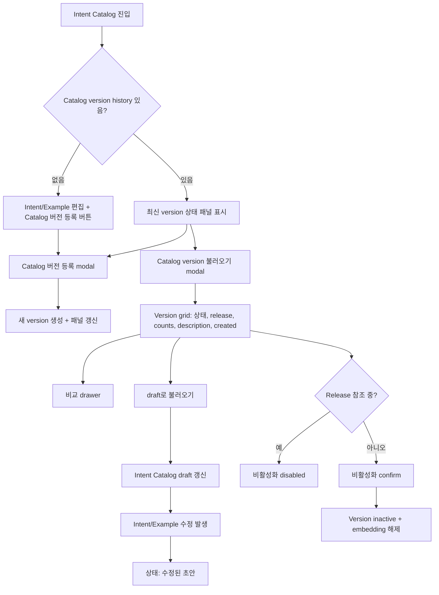

# Intent Catalog Version UI Consolidation Implementation Plan

> **For agentic workers:** REQUIRED SUB-SKILL: Use superpowers:subagent-driven-development (recommended) or superpowers:executing-plans to implement this plan task-by-task. Steps use checkbox (`- [ ]`) syntax for tracking.

**Goal:** Remove the standalone `Catalog 버전관리` menu/page and fold catalog version registration, loading, comparison, and deactivation into the `Intent Catalog` screen.

**Architecture:** Keep existing Admin API service functions unchanged. Extract the current Catalog version table/actions from `pages/CatalogVersions` into reusable Intent Catalog components, then compose them inside the Intents page as a version status panel plus modals/drawers.

**Tech Stack:** React, TypeScript, Umi 4, Ant Design, ProComponents, Umi `request`, existing AdminShell and service-scoped Admin API calls.

## Global Constraints

- Use `AdminShell` and keep `ServiceScopeBar` directly below the page title area.
- Do not introduce React Query, axios, fake pagination, live polling, or browser-supplied trusted headers.
- Keep the page table-first and operational; no landing/hero layout.
- Use compact Ant Design tables with clear single-line cells, stable widths, and no nested cards.
- Dangerous or irreversible actions must use `Modal.confirm` or the existing confirm pattern.
- The `Catalog 버전관리` navigation item must disappear.
- Catalog version API services in `src/services/adminServices.ts` should remain the single source for API calls.

---

## Target UX

### Intent Catalog Page Layout

1. Page header remains `Intent Catalog`.
2. The next-step bar stays near the top, but version actions move into a compact `Catalog version` panel below it.
3. The version panel shows the current/latest loaded state:
   - version
   - status
   - release state
   - created date
   - description
   - draft/modified state after any intent/example mutation
4. Version panel actions:
   - `Catalog 버전 등록`
   - `Catalog version 불러오기`
   - `비교`
   - `비활성화` only when applicable and not release-referenced
5. Intent list remains the primary table below the version panel.

### Catalog Version Load Modal

The load modal should become the replacement for the standalone Catalog version list page:

- Table columns: version, description, status, release, intent count, example count, embedding count, created date, actions.
- Row actions: compare, draft로 불러오기, more menu with deactivate when allowed.
- Empty state: show a compact empty table only; do not render a separate page or marketing text.
- Selection behavior: clicking a row selects it; primary footer action loads the selected version to draft.

### Catalog Version Registration Modal

- Opened from `Intent Catalog`.
- Requires description with trimmed length >= 10.
- On success:
  - close modal
  - refresh version state
  - refresh version table cache if modal is open
  - keep user on `Intent Catalog`

### Diff Drawer

- Opened from the version panel or version modal row action.
- Use the existing diff behavior from `CatalogVersionsPage`.
- Prefer a drawer so the user keeps list context.
- Show target version and baseline version at the top.

---

## Files

- Modify: `frontend/intent-routing-console/src/pages/Intents/index.tsx`
- Create: `frontend/intent-routing-console/src/pages/Intents/catalogVersionTypes.ts`
- Create: `frontend/intent-routing-console/src/pages/Intents/CatalogVersionPanel.tsx`
- Create: `frontend/intent-routing-console/src/pages/Intents/CatalogVersionHistoryModal.tsx`
- Create: `frontend/intent-routing-console/src/pages/Intents/CatalogVersionCreateModal.tsx`
- Create: `frontend/intent-routing-console/src/pages/Intents/CatalogVersionDiffDrawer.tsx`
- Delete or leave unused then remove route: `frontend/intent-routing-console/src/pages/CatalogVersions/index.tsx`
- Modify: `frontend/intent-routing-console/config/config.ts`
- Modify: `frontend/intent-routing-console/src/components/adminShellNavigation.ts`
- Modify: `frontend/intent-routing-console/src/components/AdminShell.tsx`
- Modify: `frontend/intent-routing-console/src/pages/Intents/intentsPageContract.test.ts`
- Replace/delete: `frontend/intent-routing-console/src/pages/CatalogVersions/catalogVersionsPageContract.test.ts`
- Modify: `frontend/intent-routing-console/src/components/adminShellNavigation.test.ts`

---

## Task 1: Prepare Shared Catalog Version UI Types

**Deliverable:** Catalog version UI state can be reused by the new sibling components without importing types back from `Intents/index.tsx`.

- [ ] Create `frontend/intent-routing-console/src/pages/Intents/catalogVersionTypes.ts`.
  - Export:
    - `CatalogPageState`
    - `CatalogVersionDiffSectionKey`
    - `CatalogVersionDiffSection`
- [ ] Move the current local `CatalogPageState` type out of `frontend/intent-routing-console/src/pages/Intents/index.tsx`.
- [ ] Import `CatalogPageState` back into `Intents/index.tsx` using `import type`.
- [ ] Do not create a type-only circular import from sibling components back to `Intents/index.tsx`.
- [ ] Run:
  - `./node_modules/.bin/tsc --noEmit`

## Task 2: Extract Catalog Version Display and Actions

**Deliverable:** A reusable set of Intent Catalog-local components carries the old Catalog version page behavior without a standalone page.

- [ ] Create `CatalogVersionPanel.tsx`.
  - Props:
    - `state?: CatalogPageState`
    - `historyExists: boolean`
    - `canManage: boolean`
    - `onCreate: () => void`
    - `onOpenHistory: () => void`
    - `onCompareCurrent: () => void`
    - `onDeactivateCurrent: () => void`
  - Show nothing when no history exists, except keep create action available elsewhere in the Intents toolbar/header.
  - Use light `Alert`/panel styling, not a dark filled state block.
- [ ] Create `CatalogVersionHistoryModal.tsx`.
  - Move the table columns from `CatalogVersionsPage` into the modal.
  - Keep table cells single-line with `ellipsis` and `Tooltip` for long descriptions.
  - Use `scroll={{ x: 1280, y: 360 }}` or equivalent stable dimensions.
  - Keep no more than two inline row actions; keep deactivation in a more menu.
- [ ] Create `CatalogVersionCreateModal.tsx`.
  - Move the existing create form from `CatalogVersionsPage`.
  - Preserve trimmed min length >= 10.
  - Use `Input.TextArea`, `showCount`, `maxLength={500}`.
- [ ] Create `CatalogVersionDiffDrawer.tsx`.
  - Move existing diff drawer logic and rendering.
  - Keep target/baseline descriptions at top.
  - Keep diff sections compact and scrollable.
- [ ] Move the diff baseline selection into a small pure helper in the same component file or a sibling helper.
  - Input: `versions: API.CatalogVersionListItem[]`, `target: API.CatalogVersionListItem`
  - Output: the latest version whose `created_at` is earlier than the target, excluding the target itself.
  - Add a narrow test or contract assertion that this logic does not pick the newest or oldest version accidentally.

## Task 3: Wire Version Management Into `Intent Catalog`

**Deliverable:** Intent Catalog becomes the single screen for editing and version management.

- [ ] Modify `frontend/intent-routing-console/src/pages/Intents/index.tsx`.
  - Import the new catalog version components.
  - Reuse existing `listCatalogVersions`, `createCatalogVersion`, `fetchCatalogVersionDiff`, `loadCatalogVersionToDraft`, and `deactivateCatalogVersion`.
  - Replace the current compact load modal table with `CatalogVersionHistoryModal`.
  - Add `Catalog 버전 등록` as the primary version action near the version panel, not as a separate page action.
  - After successful create/load/deactivate:
    - refresh latest version state
    - refresh intent list when load-to-draft changes the draft
    - clear selected intent/examples if load-to-draft replaces the draft
- [ ] Preserve existing behavior:
  - no history: do not show the version status panel
  - history exists: show the latest version even if inactive
  - any intent/example mutation marks current page state as draft
  - release-referenced versions cannot be deactivated

## Task 4: Remove Standalone Catalog Version Navigation

**Deliverable:** `Catalog 버전관리` no longer appears as a sidebar item after the Intents page already contains create/load/compare/deactivate functionality.

- [ ] Update `frontend/intent-routing-console/src/components/adminShellNavigation.ts`.
  - Remove the `/catalog-versions` route spec.
  - Remove `catalogVersions` from `AdminShellRouteIcon` if no longer used.
- [ ] Update `frontend/intent-routing-console/src/components/AdminShell.tsx`.
  - Remove `BranchesOutlined` import and `catalogVersions` icon mapping if unused.
- [ ] Update `frontend/intent-routing-console/config/config.ts`.
  - Prefer `{ path: '/catalog-versions', redirect: '/intents' }` if preserving direct bookmarks is acceptable.
  - Otherwise remove the route entirely if the product decision is that the old URL should not exist.
  - Do not leave a route pointing at a deleted `./CatalogVersions` component.
- [ ] Update `frontend/intent-routing-console/src/components/adminShellNavigation.test.ts`.
  - Assert `Catalog 버전관리` is not present for service developers.
  - Assert `/intents`, `/releases`, and `/test-runs` still remain.
- [ ] Run:
  - `./node_modules/.bin/vitest run src/components/adminShellNavigation.test.ts`

## Task 5: Remove the Old Catalog Versions Page Contract

**Deliverable:** Tests describe the new single-screen behavior.

- [ ] Delete or rewrite `frontend/intent-routing-console/src/pages/CatalogVersions/catalogVersionsPageContract.test.ts`.
  - If the page file is deleted, remove the test file.
  - If the route redirects, test the redirect in config/navigation tests instead.
- [ ] Extend `frontend/intent-routing-console/src/pages/Intents/intentsPageContract.test.ts`.
  - Assert `createCatalogVersion(session.serviceId` appears in Intents flow.
  - Assert `fetchCatalogVersionDiff` appears in Intents flow.
  - Assert `deactivateCatalogVersion` appears in Intents flow.
  - Assert `Catalog version 불러오기` opens a full lifecycle grid.
  - Assert `display_version`, `description`, `status`, `release_count`, `intent_count`, `example_count`, `embedding_count`, `created_at` are represented.
  - Assert no manual internal catalog version ID input is added.
- [ ] Run:
  - `./node_modules/.bin/vitest run src/pages/Intents/intentsPageContract.test.ts src/components/adminShellNavigation.test.ts`

## Task 6: Visual and Interaction Verification

**Deliverable:** The consolidated screen is usable at desktop and narrow widths.

- [ ] Start the frontend dev server.
- [ ] Open `/intents`.
- [ ] Verify no `Catalog 버전관리` menu item appears.
- [ ] Verify `Intent Catalog` shows:
  - service scope bar
  - next-step bar
  - catalog version state panel when history exists
  - intent table
- [ ] Click `Catalog 버전 등록`.
  - Verify validation blocks descriptions shorter than 10 trimmed characters.
  - Verify successful registration keeps the user on `/intents`.
- [ ] Click `Catalog version 불러오기`.
  - Verify the modal table has no clipped action column.
  - Verify version row selection and draft load.
  - Verify compare drawer opens from a row.
  - Verify released versions show disabled deactivation.
- [ ] After editing intent/example, verify the version panel changes to draft/modified state.
- [ ] Treat this browser walkthrough as mandatory completion evidence. The existing Vitest tests are source-string contract checks and do not prove rendered click behavior.
- [ ] Run final checks:
  - `./node_modules/.bin/vitest run src/pages/Intents/intentsPageContract.test.ts src/components/adminShellNavigation.test.ts src/services/adminServices.test.ts`
  - `max setup && ./node_modules/.bin/tsc --noEmit`
  - `rg -n "React Query|@tanstack|useQuery|useMutation|queryClient|invalidateQueries|axios|Authorization: Bearer|X-Admin-Token|X-Actor-Id|X-Actor-Roles|X-Service-Scope|server pagination|live polling" frontend/intent-routing-console/src/pages/Intents frontend/intent-routing-console/src/components frontend/intent-routing-console/src/services`

---

## Recommended Commit Split

1. `refactor: prepare intent catalog version ui types`
2. `refactor: extract catalog version intent components`
3. `feat: manage catalog versions from intents page`
4. `refactor: remove catalog version navigation`
5. `test: update intent catalog version ui contracts`

Do not merge or deploy commit 4 before commit 3. Removing the standalone menu first would temporarily remove create/compare/deactivate UI from the app.

---

## Claude Sonnet Plan Review Decisions

- F-1 accepted: move standalone navigation removal after the Intents page has full version-management functionality.
- F-2 accepted: add `catalogVersionTypes.ts` to avoid importing page-local types from `Intents/index.tsx`.
- F-3 accepted: final typecheck should match the project script and run `max setup && tsc --noEmit`.
- F-4 partially accepted: keep redirect as a viable option, but make the route decision explicit instead of assuming it.
- T-1 accepted: source-string Vitest checks are not sufficient; browser walkthrough is mandatory.
- T-2 accepted: add a focused check for diff baseline selection.

---

## Final Flow

