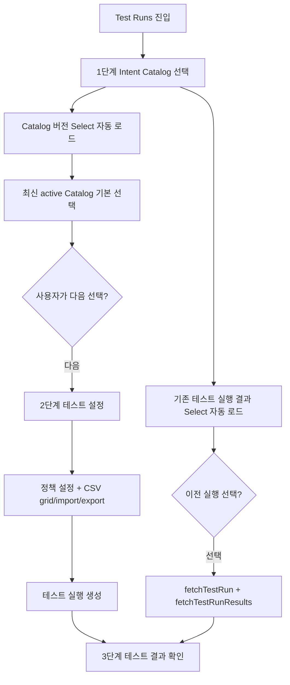

# Test Runs Catalog Step UX Refinement Implementation Plan

> **For agentic workers:** REQUIRED SUB-SKILL: Use superpowers:subagent-driven-development (recommended) or superpowers:executing-plans to implement this plan task-by-task. Steps use checkbox (`- [ ]`) syntax for tracking.

**Goal:** Rework Test Runs wizard step 1 so Catalog version selection and previous test run lookup are labeled, compact, combo-based controls instead of loose buttons and manual ID entry.

**Architecture:** Keep the existing three-step Test Runs wizard and existing Admin API service functions. Make `CatalogVersionStep` a Select-only catalog selector that loads version candidates on entry and selects the latest active version by default. Add a focused `TestRunHistorySelect` component that uses `listTestRuns` to show prior DB-backed executions as a searchable combo and lets the page load the selected run into step 3 with the existing `fetchTestRun` and `fetchTestRunResults` flow.

**Tech Stack:** React, TypeScript, Umi 4, Ant Design, ProComponents, Umi `request`, existing `AdminShell`, existing `adminServices.ts`.

## Global Constraints

- Work from local `main` after the PR #54 wizard implementation is pulled.
- Leave unrelated untracked files untouched, including `docs/superpowers/plans/2026-07-21-intent-catalog-version-ui-consolidation.md`.
- Do not add React Query, `@tanstack/react-query`, axios, fake server pagination, live polling, or browser-supplied trusted headers.
- Use existing service-scoped Admin API functions from `frontend/intent-routing-console/src/services/adminServices.ts`.
- Remove the standalone `최신 Catalog 버전` and `전체 버전 불러오기` buttons from Test Runs step 1.
- Catalog version selection must happen through the catalog version combo.
- Previous test run lookup must happen through a DB-backed combo using `listTestRuns`, not a manual `test_run_id` text field.
- Keep `ServiceScopeBar` placement and the existing `AdminShell` page structure.
- Keep the wizard page operational and dense. Do not add a landing page, hero section, nested cards, decorative cards, or marketing copy.
- Use labels and helper text for each control. Do not rely on placeholder text as the only explanation.
- Keep technical identifiers visible where useful, but make the primary decision text human-readable.

---

## Current Evidence

- `frontend/intent-routing-console/src/pages/TestRuns/CatalogVersionStep.tsx` currently imports `Button`, maintains `versionMode`, and renders the two buttons `최신 Catalog 버전` and `전체 버전 불러오기`.
- `frontend/intent-routing-console/src/pages/TestRuns/index.tsx` currently creates `lookupForm`, renders an inline `Input placeholder="tr_..."`, and submits `test_run_id` manually through `handleLookup`.
- `frontend/intent-routing-console/src/services/adminServices.ts` already exposes `listTestRuns(serviceId, { gate_passed, risk_passed, limit })`, so the frontend can load historical run candidates from the existing API.
- `frontend/intent-routing-console/src/types/api.d.ts` already defines `API.TestRunListItem` with `test_run_id`, `source_filename`, `policy_version`, `intent_catalog_version`, `created_at`, `gate_passed`, `pass_rate`, and `risk_pass_rate`.
- `docs/AdminUI_Handbook/v04/PATTERN_KIT.md` says workflow candidate selectors must prefer service-scoped selectors over manual internal ID entry, including catalog versions and test runs.

## Target UX

Step 1 becomes a compact decision surface with two labeled areas:

1. **Catalog 버전**
   - A single searchable `Select`.
   - Loads up to 100 catalog versions on entry.
   - Selects the latest active version by default.
   - Shows `display_version`, status, release state, embedding count, description, model, and vector index in each option.
   - Shows a compact selected-version summary below the combo using labels, not unlabeled loose chips.
   - Keeps the warning alert only when the selected catalog is inactive or not fully reproducible.

2. **기존 테스트 실행 결과**
   - A single searchable `Select`.
   - Loads previous test runs from `listTestRuns(serviceId, { limit: 50 })`.
   - Shows dataset/source filename, gate state, pass rate, risk pass rate, created date, policy version, catalog version, and `test_run_id`.
   - Selecting a run calls the existing result-loading path and moves the wizard to step 3.
   - Empty state says there are no prior test runs for the current service.

The big explanatory blue alert in the screenshot is replaced by concise field help plus the existing warning alert only when a risky selection is made. The page should feel filled by useful controls and summaries, not by large empty vertical space.

## Files

- Modify: `frontend/intent-routing-console/src/pages/TestRuns/CatalogVersionStep.tsx`
- Create: `frontend/intent-routing-console/src/pages/TestRuns/TestRunHistorySelect.tsx`
- Modify: `frontend/intent-routing-console/src/pages/TestRuns/index.tsx`
- Modify: `frontend/intent-routing-console/src/pages/TestRuns/catalogVersionStepContract.test.ts`
- Create: `frontend/intent-routing-console/src/pages/TestRuns/testRunHistorySelectContract.test.ts`
- Modify: `frontend/intent-routing-console/src/pages/TestRuns/testRunsPageContract.test.ts`
- Modify: `frontend/intent-routing-console/src/global.less`

## Task 1: Lock the Step 1 Catalog Selector Contract

**Files:**
- Modify: `frontend/intent-routing-console/src/pages/TestRuns/catalogVersionStepContract.test.ts`
- Test: `frontend/intent-routing-console/src/pages/TestRuns/catalogVersionStepContract.test.ts`

**Interfaces:**
- Consumes: existing `CatalogVersionStep.tsx`
- Produces: contract expectations that later tasks satisfy

- [ ] **Step 1: Replace the catalog step contract tests**

Replace the body of `catalogVersionStepContract.test.ts` with:

```ts
import { readFileSync } from 'node:fs';
import { dirname, join } from 'node:path';
import { fileURLToPath } from 'node:url';
import { describe, expect, it } from 'vitest';

const read = (file: string) =>
  readFileSync(join(dirname(fileURLToPath(import.meta.url)), file), 'utf8');

describe('CatalogVersionStep contract', () => {
  it('loads catalog versions into a single labeled combo and selects the latest active version', () => {
    const source = read('CatalogVersionStep.tsx');

    expect(source).toContain('listCatalogVersions(serviceId');
    expect(source).toContain('CATALOG_VERSION_LIMIT');
    expect(source).toContain('const defaultVersion = nextVersions.find');
    expect(source).toContain("version.status === 'active'");
    expect(source).toContain('onChangeRef.current(defaultVersion);');
    expect(source).toContain('htmlFor="test-run-catalog-version-select"');
    expect(source).toContain('id="test-run-catalog-version-select"');
    expect(source).toContain('Catalog 버전');
    expect(source).toContain('<Select');
  });

  it('removes the separate latest and load-all buttons from step one', () => {
    const source = read('CatalogVersionStep.tsx');

    expect(source).not.toContain('<Button');
    expect(source).not.toContain('handleLoadLatest');
    expect(source).not.toContain('setVersionMode');
    expect(source).not.toContain('versionMode');
    expect(source).not.toContain('최신 Catalog 버전');
    expect(source).not.toContain('전체 버전 불러오기');
  });

  it('keeps old catalog selection available through option metadata and warning state', () => {
    const source = read('CatalogVersionStep.tsx');

    expect(source).toContain('status: undefined');
    expect(source).toContain('reproducibility_status');
    expect(source).toContain('선택한 Catalog 버전 상태를 확인하세요');
    expect(source).toContain('optionRender');
    expect(source).toContain('display_version');
    expect(source).toContain('embedding_count');
    expect(source).not.toContain('intent_catalog_version"');
  });

  it('uses the catalog-only step in the Test Runs wizard', () => {
    const page = read('index.tsx');

    expect(page).toContain('<Steps');
    expect(page).toContain('<CatalogVersionStep');
    expect(page).toContain('key={session.serviceId}');
    expect(page).not.toContain('<ValidationVersionsPanel');
  });
});
```

- [ ] **Step 2: Run the focused test and confirm it fails for the current UI**

Run:

```bash
cd frontend/intent-routing-console
./node_modules/.bin/vitest run src/pages/TestRuns/catalogVersionStepContract.test.ts
```

Expected:

```text
FAIL src/pages/TestRuns/catalogVersionStepContract.test.ts
```

The failure should mention at least one of these current implementation details:

```text
<Button
versionMode
최신 Catalog 버전
전체 버전 불러오기
```

## Task 2: Convert `CatalogVersionStep` to a Select-Only Labeled Control

**Files:**
- Modify: `frontend/intent-routing-console/src/pages/TestRuns/CatalogVersionStep.tsx`
- Modify: `frontend/intent-routing-console/src/global.less`
- Test: `frontend/intent-routing-console/src/pages/TestRuns/catalogVersionStepContract.test.ts`

**Interfaces:**
- Consumes: `listCatalogVersions(serviceId, params)`
- Produces: `CatalogVersionStep({ serviceId, value, onChange })`

- [ ] **Step 1: Replace `CatalogVersionStep.tsx`**

Replace `frontend/intent-routing-console/src/pages/TestRuns/CatalogVersionStep.tsx` with:

```tsx
import { useCallback, useEffect, useMemo, useRef, useState } from 'react';
import { Alert, Descriptions, Select, Space, Tag, Typography } from 'antd';
import { VersionChip } from '@/components/VersionChip';
import { listCatalogVersions } from '@/services/adminServices';

type CatalogVersionStepProps = {
  serviceId: string;
  value?: API.CatalogVersionListItem;
  onChange: (value?: API.CatalogVersionListItem) => void;
};

const CATALOG_VERSION_LIMIT = 100;

const catalogVersionStatusColor: Record<API.CatalogVersionStatus, string> = {
  active: 'green',
  inactive: 'default',
};

const catalogVersionSearchLabel = (version: API.CatalogVersionListItem) =>
  [
    version.display_version,
    version.description,
    version.intent_catalog_version,
    version.status,
    version.model_version,
    version.vector_index_version,
  ]
    .filter(Boolean)
    .join(' ');

export function CatalogVersionStep({
  serviceId,
  value,
  onChange,
}: CatalogVersionStepProps) {
  const [loading, setLoading] = useState(false);
  const [versions, setVersions] = useState<API.CatalogVersionListItem[]>([]);
  const valueRef = useRef(value);
  const onChangeRef = useRef(onChange);
  const versionRequestRef = useRef(0);

  valueRef.current = value;
  onChangeRef.current = onChange;

  const selectedValue = value?.intent_catalog_version;
  const selectedVersion = useMemo(
    () =>
      versions.find(
        (version) => version.intent_catalog_version === selectedValue,
      ) ?? value,
    [selectedValue, value, versions],
  );
  const selectedCatalogVersionWarning = selectedVersion
    ? selectedVersion.status !== 'active' ||
      selectedVersion.reproducibility_status !== 'complete'
    : false;

  const loadVersions = useCallback(async () => {
    const requestId = versionRequestRef.current + 1;
    versionRequestRef.current = requestId;
    setLoading(true);
    try {
      const nextVersions = await listCatalogVersions(serviceId, {
        limit: CATALOG_VERSION_LIMIT,
        status: undefined,
      });
      if (versionRequestRef.current !== requestId) return;
      setVersions(nextVersions);
      if (!valueRef.current) {
        const defaultVersion =
          nextVersions.find((version) => version.status === 'active') ??
          nextVersions[0];
        onChangeRef.current(defaultVersion);
      }
    } finally {
      if (versionRequestRef.current === requestId) setLoading(false);
    }
  }, [serviceId]);

  useEffect(() => {
    void loadVersions();
  }, [loadVersions]);

  useEffect(() => {
    return () => {
      versionRequestRef.current += 1;
    };
  }, []);

  return (
    <Space direction="vertical" size={12} style={{ width: '100%' }}>
      <Space direction="vertical" size={4}>
        <Typography.Title level={5} style={{ margin: 0 }}>
          Intent Catalog 선택
        </Typography.Title>
        <Typography.Text type="secondary">
          테스트에 사용할 Catalog 스냅샷을 선택합니다. 기본값은 최신 active 버전입니다.
        </Typography.Text>
      </Space>
      <div className="test-run-step-field">
        <label
          className="test-run-step-field-label"
          htmlFor="test-run-catalog-version-select"
        >
          Catalog 버전
        </label>
        <Select
          id="test-run-catalog-version-select"
          showSearch
          allowClear
          value={selectedValue}
          loading={loading}
          placeholder="Catalog 버전을 선택하세요"
          optionFilterProp="label"
          className="test-run-step-select"
          options={versions.map((version) => ({
            value: version.intent_catalog_version,
            label: catalogVersionSearchLabel(version),
            catalogVersion: version,
          }))}
          onChange={(nextVersionId) => {
            onChange(
              versions.find(
                (version) => version.intent_catalog_version === nextVersionId,
              ),
            );
          }}
          optionRender={({ data }) => {
            const version = data.catalogVersion as API.CatalogVersionListItem;
            return (
              <Space direction="vertical" size={2}>
                <Space wrap size={6}>
                  <Typography.Text strong>
                    {version.display_version}
                  </Typography.Text>
                  <Tag color={catalogVersionStatusColor[version.status]}>
                    {version.status}
                  </Tag>
                  <Tag>
                    {version.released ? `released ${version.release_count}` : 'unreleased'}
                  </Tag>
                  <Tag>{version.embedding_count} embeddings</Tag>
                </Space>
                <Typography.Text type="secondary" ellipsis>
                  {version.description || version.intent_catalog_version}
                </Typography.Text>
                <Typography.Text type="secondary">
                  model {version.model_version || 'none'} / vector{' '}
                  {version.vector_index_version || 'none'}
                </Typography.Text>
              </Space>
            );
          }}
        />
        <Typography.Text type="secondary" className="test-run-step-field-help">
          선택한 Catalog 버전은 테스트 결과와 Release 후보에서 그대로 참조됩니다.
        </Typography.Text>
      </div>
      {selectedVersion ? (
        <Descriptions
          className="test-run-step-summary"
          size="small"
          column={{ xs: 1, md: 2, xl: 3 }}
          items={[
            {
              key: 'catalog',
              label: 'Catalog',
              children: (
                <VersionChip
                  label="Catalog"
                  value={selectedVersion.intent_catalog_version}
                />
              ),
            },
            {
              key: 'status',
              label: '상태',
              children: (
                <Tag color={catalogVersionStatusColor[selectedVersion.status]}>
                  {selectedVersion.status}
                </Tag>
              ),
            },
            {
              key: 'version',
              label: '버전',
              children: selectedVersion.display_version,
            },
            {
              key: 'reproducibility',
              label: '재현성',
              children: selectedVersion.reproducibility_status,
            },
            {
              key: 'model',
              label: '모델',
              children: selectedVersion.model_version || 'none',
            },
            {
              key: 'vector',
              label: 'Vector index',
              children: selectedVersion.vector_index_version || 'none',
            },
          ]}
        />
      ) : null}
      {selectedCatalogVersionWarning && selectedVersion ? (
        <Alert
          type="warning"
          showIcon
          message="선택한 Catalog 버전 상태를 확인하세요"
          description={`status=${selectedVersion.status}, reproducibility=${selectedVersion.reproducibility_status}`}
        />
      ) : null}
    </Space>
  );
}
```

- [ ] **Step 2: Add compact Step 1 layout styles**

Append this block to `frontend/intent-routing-console/src/global.less`:

```less
.test-run-step-grid {
  align-items: start;
  display: grid;
  gap: 16px 24px;
  grid-template-columns: minmax(328px, 552px) minmax(328px, 552px);
  justify-content: start;
}

.test-run-step-field {
  min-width: 0;
}

.test-run-step-field-label {
  color: #334155;
  display: block;
  font-weight: 600;
  margin-bottom: 6px;
}

.test-run-step-field-help {
  display: block;
  margin-top: 6px;
}

.test-run-step-select {
  max-width: 552px;
  width: 100%;
}

.test-run-step-summary {
  background: #f7f9fb;
  border: 1px solid #e6eaef;
  border-radius: 8px;
  max-width: 552px;
  padding: 12px;
}

@media (max-width: 900px) {
  .test-run-step-grid {
    grid-template-columns: minmax(0, 1fr);
  }
}
```

- [ ] **Step 3: Run the focused catalog selector test**

Run:

```bash
cd frontend/intent-routing-console
./node_modules/.bin/vitest run src/pages/TestRuns/catalogVersionStepContract.test.ts
```

Expected:

```text
PASS src/pages/TestRuns/catalogVersionStepContract.test.ts
```

## Task 3: Add a DB-Backed Previous Test Run Combo

**Files:**
- Create: `frontend/intent-routing-console/src/pages/TestRuns/TestRunHistorySelect.tsx`
- Create: `frontend/intent-routing-console/src/pages/TestRuns/testRunHistorySelectContract.test.ts`
- Test: `frontend/intent-routing-console/src/pages/TestRuns/testRunHistorySelectContract.test.ts`

**Interfaces:**
- Consumes: `listTestRuns(serviceId, { limit: 50 })`
- Produces: `TestRunHistorySelect({ serviceId, value, disabled, loading, onSelect })`

- [ ] **Step 1: Create the failing contract test**

Create `frontend/intent-routing-console/src/pages/TestRuns/testRunHistorySelectContract.test.ts`:

```ts
import { readFileSync } from 'node:fs';
import { dirname, join } from 'node:path';
import { fileURLToPath } from 'node:url';
import { describe, expect, it } from 'vitest';

const read = (file: string) =>
  readFileSync(join(dirname(fileURLToPath(import.meta.url)), file), 'utf8');

describe('TestRunHistorySelect contract', () => {
  it('loads previous test runs from the service-scoped API into a labeled Select', () => {
    const source = read('TestRunHistorySelect.tsx');

    expect(source).toContain('listTestRuns(serviceId');
    expect(source).toContain('TEST_RUN_HISTORY_LIMIT');
    expect(source).toContain('htmlFor="test-run-history-select"');
    expect(source).toContain('id="test-run-history-select"');
    expect(source).toContain('기존 테스트 실행 결과');
    expect(source).toContain('<Select');
    expect(source).toContain('showSearch');
    expect(source).toContain('optionRender');
  });

  it('shows decision fields in each history option without a manual test_run_id input', () => {
    const source = read('TestRunHistorySelect.tsx');

    expect(source).toContain('source_filename');
    expect(source).toContain('gate_passed');
    expect(source).toContain('pass_rate');
    expect(source).toContain('risk_pass_rate');
    expect(source).toContain('policy_version');
    expect(source).toContain('intent_catalog_version');
    expect(source).toContain('created_at');
    expect(source).toContain('test_run_id');
    expect(source).not.toContain('<Input');
    expect(source).not.toContain('test_run_id를 입력하세요');
  });

  it('selects a prior run through the component callback', () => {
    const source = read('TestRunHistorySelect.tsx');

    expect(source).toContain('onSelect: (testRunId: string) => void;');
    expect(source).toContain('onSelect(nextTestRunId);');
    expect(source).toContain('이전 실행을 선택하면 테스트 결과 확인 단계로 이동합니다.');
  });
});
```

- [ ] **Step 2: Run the history selector test and confirm it fails before the component exists**

Run:

```bash
cd frontend/intent-routing-console
./node_modules/.bin/vitest run src/pages/TestRuns/testRunHistorySelectContract.test.ts
```

Expected:

```text
FAIL src/pages/TestRuns/testRunHistorySelectContract.test.ts
```

The failure should mention:

```text
ENOENT
TestRunHistorySelect.tsx
```

- [ ] **Step 3: Create `TestRunHistorySelect.tsx`**

Create `frontend/intent-routing-console/src/pages/TestRuns/TestRunHistorySelect.tsx`:

```tsx
import { useCallback, useEffect, useMemo, useRef, useState } from 'react';
import { Empty, Select, Space, Spin, Tag, Typography } from 'antd';
import { listTestRuns } from '@/services/adminServices';

type TestRunHistorySelectProps = {
  serviceId: string;
  value?: string;
  disabled?: boolean;
  loading?: boolean;
  onSelect: (testRunId: string) => void;
};

const TEST_RUN_HISTORY_LIMIT = 50;

const formatRate = (value: number | null | undefined) => {
  if (value === null || value === undefined) return 'none';
  const normalized = value <= 1 ? value * 100 : value;
  return `${normalized.toFixed(1)}%`;
};

const formatCreatedAt = (value: string) =>
  new Intl.DateTimeFormat('ko-KR', {
    dateStyle: 'short',
    timeStyle: 'short',
  }).format(new Date(value));

const testRunSearchLabel = (run: API.TestRunListItem) =>
  [
    run.test_run_id,
    run.source_filename,
    run.policy_version,
    run.intent_catalog_version,
    run.test_dataset_version,
    run.gate_passed ? 'gate passed' : 'gate blocked',
    run.created_at,
  ]
    .filter(Boolean)
    .join(' ');

export function TestRunHistorySelect({
  serviceId,
  value,
  disabled,
  loading,
  onSelect,
}: TestRunHistorySelectProps) {
  const [runs, setRuns] = useState<API.TestRunListItem[]>([]);
  const [fetching, setFetching] = useState(false);
  const requestRef = useRef(0);

  const selectedRun = useMemo(
    () => runs.find((run) => run.test_run_id === value),
    [runs, value],
  );

  const loadRuns = useCallback(async () => {
    const requestId = requestRef.current + 1;
    requestRef.current = requestId;
    setFetching(true);
    try {
      const nextRuns = await listTestRuns(serviceId, {
        limit: TEST_RUN_HISTORY_LIMIT,
      });
      if (requestRef.current !== requestId) return;
      setRuns(nextRuns);
    } finally {
      if (requestRef.current === requestId) setFetching(false);
    }
  }, [serviceId]);

  useEffect(() => {
    void loadRuns();
  }, [loadRuns]);

  useEffect(() => {
    return () => {
      requestRef.current += 1;
    };
  }, []);

  return (
    <Space direction="vertical" size={12} style={{ width: '100%' }}>
      <Space direction="vertical" size={4}>
        <Typography.Title level={5} style={{ margin: 0 }}>
          기존 테스트 실행 결과 조회
        </Typography.Title>
        <Typography.Text type="secondary">
          이전 실행을 선택하면 테스트 결과 확인 단계로 이동합니다.
        </Typography.Text>
      </Space>
      <div className="test-run-step-field">
        <label
          className="test-run-step-field-label"
          htmlFor="test-run-history-select"
        >
          기존 테스트 실행 결과
        </label>
        <Select
          id="test-run-history-select"
          showSearch
          allowClear
          value={value}
          loading={fetching || loading}
          disabled={disabled}
          placeholder="이전 테스트 실행을 선택하세요"
          optionFilterProp="label"
          className="test-run-step-select"
          notFoundContent={
            fetching ? (
              <Spin size="small" />
            ) : (
              <Empty
                image={Empty.PRESENTED_IMAGE_SIMPLE}
                description="현재 서비스의 이전 테스트 실행이 없습니다."
              />
            )
          }
          options={runs.map((run) => ({
            value: run.test_run_id,
            label: testRunSearchLabel(run),
            testRun: run,
          }))}
          onChange={(nextTestRunId) => {
            if (nextTestRunId) onSelect(nextTestRunId);
          }}
          optionRender={({ data }) => {
            const run = data.testRun as API.TestRunListItem;
            return (
              <Space direction="vertical" size={2}>
                <Space wrap size={6}>
                  <Typography.Text strong>
                    {run.source_filename || run.test_dataset_version}
                  </Typography.Text>
                  <Tag color={run.gate_passed ? 'green' : 'red'}>
                    {run.gate_passed ? 'gate 통과' : 'gate 차단'}
                  </Tag>
                  <Tag>pass {formatRate(run.pass_rate)}</Tag>
                  <Tag>risk {formatRate(run.risk_pass_rate)}</Tag>
                </Space>
                <Typography.Text type="secondary">
                  {formatCreatedAt(run.created_at)} / policy {run.policy_version}
                </Typography.Text>
                <Typography.Text type="secondary" ellipsis>
                  catalog {run.intent_catalog_version} / run {run.test_run_id}
                </Typography.Text>
              </Space>
            );
          }}
        />
        {selectedRun ? (
          <Typography.Text type="secondary" className="test-run-step-field-help">
            선택됨: {selectedRun.test_run_id}
          </Typography.Text>
        ) : (
          <Typography.Text type="secondary" className="test-run-step-field-help">
            실행 ID를 직접 입력하지 않고 DB에 저장된 실행 목록에서 선택합니다.
          </Typography.Text>
        )}
      </div>
    </Space>
  );
}
```

- [ ] **Step 4: Run the history selector contract**

Run:

```bash
cd frontend/intent-routing-console
./node_modules/.bin/vitest run src/pages/TestRuns/testRunHistorySelectContract.test.ts
```

Expected:

```text
PASS src/pages/TestRuns/testRunHistorySelectContract.test.ts
```

## Task 4: Replace Manual Result Lookup in the Wizard Page

**Files:**
- Modify: `frontend/intent-routing-console/src/pages/TestRuns/index.tsx`
- Modify: `frontend/intent-routing-console/src/pages/TestRuns/testRunsPageContract.test.ts`
- Test: `frontend/intent-routing-console/src/pages/TestRuns/testRunsPageContract.test.ts`

**Interfaces:**
- Consumes: `CatalogVersionStep`, `TestRunHistorySelect`
- Produces: Step 1 grid with catalog selection and previous run selection

- [ ] **Step 1: Update the page contract test**

In `testRunsPageContract.test.ts`, replace the test named `keeps result lookup inside the single wizard panel without nested Cards` with:

```ts
it('shows previous test runs as a DB-backed combo in step one without nested Cards', () => {
  const page = read('index.tsx');

  expect(page).toContain('<TestRunHistorySelect');
  expect(page).toContain('onSelect={handleHistorySelect}');
  expect(page).toContain('className="test-run-step-grid"');
  expect(page.indexOf('<TestRunHistorySelect')).toBeGreaterThan(
    page.indexOf('currentStep === 0'),
  );
  expect(page).not.toContain('<Form form={lookupForm}');
  expect(page).not.toContain('test_run_id를 입력하세요');
  expect(page).not.toContain('placeholder="tr_..."');
  expect(page).not.toContain('<Card');
});
```

In the test named `localizes result and lookup labels while preserving technical identifiers`, replace the lookup assertions with:

```ts
expect(page).toContain("message.success('테스트 실행 결과를 불러왔습니다.')");
expect(page).toContain('<TestRunHistorySelect');
expect(page).toContain('기존 테스트 실행 결과');
expect(page).not.toContain('<Typography.Text code>test_run_id</Typography.Text>로 이전 실행 결과를 조회할 수 있습니다.');
expect(page).not.toContain('Test Run 결과를 불러왔습니다.');
```

In the test named `keeps a successfully created run summary visible when its results request fails`, replace the expected string with:

```ts
expect(page).toContain(
  'setSummary(created);\n      setCurrentStep(2);\n      const nextResults = await fetchTestRunResults',
);
```

- [ ] **Step 2: Run the Test Runs page contract and confirm it fails for the manual input implementation**

Run:

```bash
cd frontend/intent-routing-console
./node_modules/.bin/vitest run src/pages/TestRuns/testRunsPageContract.test.ts
```

Expected:

```text
FAIL src/pages/TestRuns/testRunsPageContract.test.ts
```

The failure should mention `TestRunHistorySelect` or `lookupForm`.

- [ ] **Step 3: Modify imports and state in `index.tsx`**

Add the new component import near the other Test Runs component imports:

```tsx
import { TestRunHistorySelect } from './TestRunHistorySelect';
```

Remove this form hook:

```tsx
const [lookupForm] = Form.useForm<{ test_run_id: string }>();
```

In the service reset effect, remove `lookupForm` from the dependency list and remove:

```tsx
lookupForm.resetFields();
```

The reset effect dependency list should become:

```tsx
}, [createForm, session.serviceId]);
```

- [ ] **Step 4: Stop writing created or loaded run IDs into `lookupForm`**

In `loadRun`, remove:

```tsx
lookupForm.setFieldsValue({ test_run_id: testRunId });
```

In `handleCreate`, remove:

```tsx
lookupForm.setFieldsValue({ test_run_id: created.test_run_id });
```

- [ ] **Step 5: Replace `handleLookup` with `handleHistorySelect`**

Replace:

```tsx
const handleLookup = async (values: { test_run_id: string }) => {
  const serviceId = session.serviceId;
  const requestGeneration = beginRunRequest();
  setLoading(true);
  try {
    const loaded = await loadRun(values.test_run_id.trim(), serviceId, requestGeneration);
    if (loaded) message.success('테스트 실행 결과를 불러왔습니다.');
  } catch {
    if (isCurrentRunRequest(requestGeneration, serviceId)) {
      message.error('테스트 실행 결과를 불러오지 못했습니다.');
    }
  } finally {
    if (isCurrentRunRequest(requestGeneration, serviceId)) setLoading(false);
  }
};
```

with:

```tsx
const handleHistorySelect = async (testRunId: string) => {
  const serviceId = session.serviceId;
  const requestGeneration = beginRunRequest();
  setLoading(true);
  try {
    const loaded = await loadRun(testRunId, serviceId, requestGeneration);
    if (loaded) message.success('테스트 실행 결과를 불러왔습니다.');
  } catch {
    if (isCurrentRunRequest(requestGeneration, serviceId)) {
      message.error('테스트 실행 결과를 불러오지 못했습니다.');
    }
  } finally {
    if (isCurrentRunRequest(requestGeneration, serviceId)) setLoading(false);
  }
};
```

- [ ] **Step 6: Render the two Step 1 selectors in a compact grid**

Replace the `currentStep === 0` block:

```tsx
{currentStep === 0 ? (
  <CatalogVersionStep
    key={session.serviceId}
    serviceId={session.serviceId}
    value={selectedCatalogVersion}
    onChange={(nextCatalogVersion) => {
      setSelectedCatalogVersion(nextCatalogVersion);
      setCatalogVersion(nextCatalogVersion?.intent_catalog_version);
      createForm.setFieldsValue({
        intent_catalog_version: nextCatalogVersion?.intent_catalog_version,
      });
    }}
  />
) : null}
```

with:

```tsx
{currentStep === 0 ? (
  <div className="test-run-step-grid">
    <CatalogVersionStep
      key={session.serviceId}
      serviceId={session.serviceId}
      value={selectedCatalogVersion}
      onChange={(nextCatalogVersion) => {
        setSelectedCatalogVersion(nextCatalogVersion);
        setCatalogVersion(nextCatalogVersion?.intent_catalog_version);
        createForm.setFieldsValue({
          intent_catalog_version: nextCatalogVersion?.intent_catalog_version,
        });
      }}
    />
    <TestRunHistorySelect
      serviceId={session.serviceId}
      value={summary?.test_run_id}
      disabled={!canRun}
      loading={loading}
      onSelect={handleHistorySelect}
    />
  </div>
) : null}
```

- [ ] **Step 7: Remove the old manual lookup section**

Delete this section from the page render:

```tsx
<section>
  <Typography.Title level={5} style={{ margin: 0 }}>
    기존 테스트 실행 결과 조회
  </Typography.Title>
  <Typography.Text type="secondary">
    <Typography.Text code>test_run_id</Typography.Text>로 이전 실행 결과를 조회할 수 있습니다.
  </Typography.Text>
  <Form form={lookupForm} layout="inline" onFinish={handleLookup}>
    <Form.Item
      name="test_run_id"
      rules={[
        { required: true, whitespace: true, message: 'test_run_id를 입력하세요.' },
      ]}
    >
      <Input placeholder="tr_..." style={{ width: 260 }} disabled={!canRun} />
    </Form.Item>
    <Button htmlType="submit" loading={loading} disabled={!canRun}>
      결과 조회
    </Button>
  </Form>
</section>
```

- [ ] **Step 8: Run the page contract**

Run:

```bash
cd frontend/intent-routing-console
./node_modules/.bin/vitest run src/pages/TestRuns/testRunsPageContract.test.ts
```

Expected:

```text
PASS src/pages/TestRuns/testRunsPageContract.test.ts
```

## Task 5: Verify Service Contracts, Type Safety, and Prohibited Patterns

**Files:**
- Verify: `frontend/intent-routing-console/src/pages/TestRuns/CatalogVersionStep.tsx`
- Verify: `frontend/intent-routing-console/src/pages/TestRuns/TestRunHistorySelect.tsx`
- Verify: `frontend/intent-routing-console/src/pages/TestRuns/index.tsx`
- Verify: `frontend/intent-routing-console/src/global.less`

**Interfaces:**
- Consumes: all prior tasks
- Produces: verified implementation ready for branch review

- [ ] **Step 1: Run the focused Test Runs contract suite**

Run:

```bash
cd frontend/intent-routing-console
./node_modules/.bin/vitest run src/pages/TestRuns/catalogVersionStepContract.test.ts src/pages/TestRuns/testRunHistorySelectContract.test.ts src/pages/TestRuns/testRunsPageContract.test.ts src/services/adminServices.test.ts
```

Expected:

```text
PASS src/pages/TestRuns/catalogVersionStepContract.test.ts
PASS src/pages/TestRuns/testRunHistorySelectContract.test.ts
PASS src/pages/TestRuns/testRunsPageContract.test.ts
PASS src/services/adminServices.test.ts
```

- [ ] **Step 2: Run TypeScript**

Run:

```bash
cd frontend/intent-routing-console
./node_modules/.bin/tsc --noEmit
```

Expected:

```text
no TypeScript errors
```

- [ ] **Step 3: Search changed implementation files for prohibited frontend patterns**

Run:

```bash
cd frontend/intent-routing-console
rg -n "React Query|@tanstack|useQuery|useMutation|queryClient|invalidateQueries|axios|Authorization: Bearer|X-Admin-Token|X-Actor-Id|X-Actor-Roles|X-Service-Scope|server pagination|live polling" src/pages/TestRuns src/global.less src/services/adminServices.ts
```

Expected:

```text
no matches
```

- [ ] **Step 4: Run a source-level UI smoke check**

Run:

```bash
cd frontend/intent-routing-console
rg -n "최신 Catalog 버전|전체 버전 불러오기|placeholder=\"tr_\\.\\.\\.\"|test_run_id를 입력하세요|<Form form=\\{lookupForm\\}" src/pages/TestRuns
```

Expected:

```text
no matches
```

Run:

```bash
cd frontend/intent-routing-console
rg -n "test-run-catalog-version-select|test-run-history-select|test-run-step-grid|TestRunHistorySelect|listTestRuns\\(serviceId" src/pages/TestRuns src/global.less
```

Expected output contains these lines:

```text
src/pages/TestRuns/CatalogVersionStep.tsx
src/pages/TestRuns/TestRunHistorySelect.tsx
src/pages/TestRuns/index.tsx
src/global.less
```

## Task 6: Browser Visual Verification

**Files:**
- Verify visually: `frontend/intent-routing-console/src/pages/TestRuns/index.tsx`
- Verify visually: `frontend/intent-routing-console/src/pages/TestRuns/CatalogVersionStep.tsx`
- Verify visually: `frontend/intent-routing-console/src/pages/TestRuns/TestRunHistorySelect.tsx`
- Verify visually: `frontend/intent-routing-console/src/global.less`

**Interfaces:**
- Consumes: built frontend from Tasks 1-5
- Produces: visual confidence for desktop and narrow widths

- [ ] **Step 1: Start the frontend dev server**

Run:

```bash
cd frontend/intent-routing-console
npm run dev
```

Expected:

```text
ready
```

Record the local URL printed by Umi.

- [ ] **Step 2: Open `/test-runs` at desktop width**

Use the browser at approximately `1920x1080`.

Expected:

```text
The first wizard step shows two labeled controls in one compact row:
Catalog 버전
기존 테스트 실행 결과
```

The page must not show:

```text
최신 Catalog 버전
전체 버전 불러오기
tr_...
결과 조회
```

- [ ] **Step 3: Inspect the Catalog version combo**

Open the Catalog combo.

Expected:

```text
Each option shows display_version, status, release state, embedding count, description, model, and vector index.
```

Select an inactive or incomplete catalog version if one exists.

Expected:

```text
The warning alert appears below the selected-version summary.
```

- [ ] **Step 4: Inspect the previous test run combo**

Open the previous test run combo.

Expected:

```text
Each option shows source filename or dataset, gate state, pass rate, risk pass rate, created date, policy version, catalog version, and test_run_id.
```

Select one previous run.

Expected:

```text
The wizard moves to 테스트 결과 확인 and renders the summary, diagnostics panel, and results table for the selected run.
```

- [ ] **Step 5: Resize to narrow width**

Use the browser at approximately `390x844`.

Expected:

```text
The two Step 1 controls stack vertically, labels stay attached to their controls, option text truncates inside the Select, and no text overlaps the stepper or navigation buttons.
```

## Recommended Commit Split

1. `test: lock test run selector ux contracts`
2. `feat: simplify catalog version selection in test runs`
3. `feat: add previous test run selector`
4. `test: verify test runs wizard lookup flow`

## Final Flow


